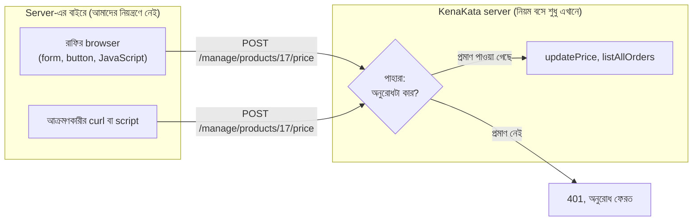
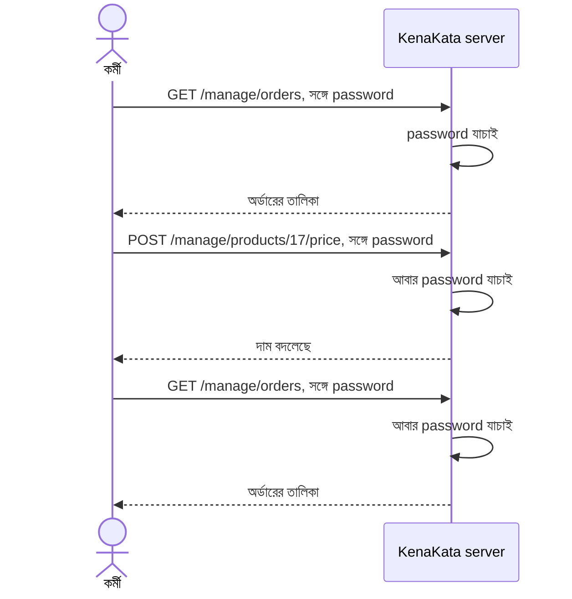
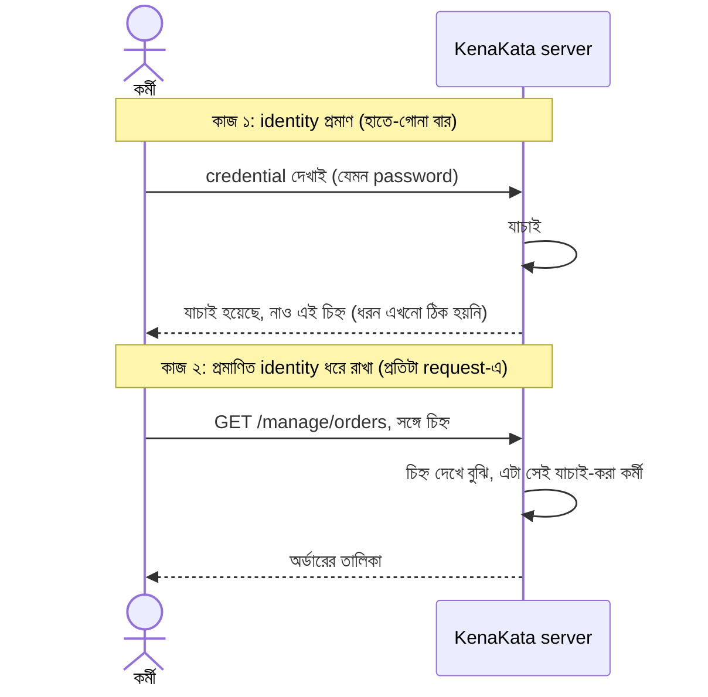

# কেন Authentication দরকার?

মঙ্গলবার সকাল। আরিফ প্রথম চায়ের কাপে চুমুক দেওয়ার আগেই ফোন বাজল। ওপাশে রাফি।

"ভাই, একটা অদ্ভুত ব্যাপার। আমার সবচেয়ে বিক্রি হওয়া পাঞ্জাবিটার দাম সাইটে দেখাচ্ছে 120। কাল রাত পর্যন্ত ছিল 1200। রাতে ওই দামে ছয়টা অর্ডার চলে এসেছে।"

"আপনি বদলেছেন?"

"আমি না। কর্মচারীরাও বলছে, করেনি।"

আরিফ চুপ করে গেল। তার মাথায় একটাই প্রশ্ন, আর সেই প্রশ্নের উত্তর তার system-এর কাছে নেই: **কে করল?**

---

## ১. প্রথম সংস্করণ: "ভেতরের পেজ তো ভেতরের লোকেরাই দেখবে"

KenaKata তখনো খুব ছোট। একটা server-rendered web application, একটাই দোকান (রাফির পোশাকের ব্যবসা), আর তিনটা কাজ: পণ্য দেখানো, ক্রেতার তথ্য রাখা, অর্ডার নেওয়া।

নীরা আগের দিন বলেছিল, "রাফি কাল থেকে সত্যিকারের অর্ডার নেবে। আমাদের হাতে আজকের দিনটাই আছে।"

আরিফ ঠিক করেছিল, দোকানের সামনের দিক সবার জন্য খোলা থাকবে। পণ্য দেখতে বা অর্ডার দিতে ক্রেতার account লাগে না, কারণ KenaKata-য় ক্রেতা login করে না। আর ভেতরের দিক, মানে অর্ডারের তালিকা আর দাম বদলানোর পেজ, `/manage` দিয়ে শুরু হবে। ওগুলো তো রাফি আর তার কর্মচারীরাই ব্যবহার করবে। Login পরে বানালেও চলবে।

| Path | কী করে | কার জন্য (আরিফের ধারণায়) |
|---|---|---|
| `GET /products` | পণ্যের তালিকা দেখায় | সবাই |
| `POST /orders` | নতুন অর্ডার নেয় | সবাই (ক্রেতা) |
| `GET /manage/orders` | সব অর্ডার, সঙ্গে নাম-ফোন-ঠিকানা | শুধু রাফি আর তার লোক |
| `POST /manage/products/{id}/price` | পণ্যের দাম বদলায় | শুধু রাফি আর তার লোক |

কোডটা ছিল এরকম:

```go
package main

import (
	"log"
	"net/http"
)

func main() {
	mux := http.NewServeMux()

	// দোকানের সামনের দিক: সবার জন্য খোলা, এটাই চাই
	mux.HandleFunc("GET /products", listProducts)
	mux.HandleFunc("POST /orders", placeOrder)

	// ভেতরের দিক: "শুধু রাফির লোক ব্যবহার করবে" (এটা আরিফের আশা)
	mux.HandleFunc("GET /manage/orders", listAllOrders)
	mux.HandleFunc("POST /manage/products/{id}/price", updatePrice)

	log.Fatal(http.ListenAndServe(":8080", mux))
}

// Go 1.22+ লাগবে: method সহ route pattern আর r.PathValue-এর জন্য।
// listProducts, placeOrder, listAllOrders এখানে দেখানো হয়নি।
func updatePrice(w http.ResponseWriter, r *http.Request) {
	id := r.PathValue("id")
	price := r.FormValue("price")

	// ... database-এ দাম বদলে দেওয়া হলো ...

	log.Printf("price updated: product=%s price=%s", id, price)
	w.WriteHeader(http.StatusNoContent)
}
```

এবার কোডটা আরেকবার পড়ো, একটা প্রশ্ন নিয়ে: **কোথায় বলা আছে যে `updatePrice` শুধু রাফির লোকেরা চালাতে পারবে?**

কোথাও নেই। "শুধু ওরাই ব্যবহার করবে" একটা আশা, system-এর নিয়ম নয়। Path-এর নামে `manage` লেখা থাকলে সেটা private হয়ে যায় না। ওটা শুধু একটা নাম।

আরও একটা কথা। HTTP server-এর চোখে `POST /manage/products/17/price` আর `POST /orders` একই ধরনের জিনিস: একটা method, একটা path, কিছু byte। "ভেতরের" আর "বাইরের" বলে কোনো ভাগ প্রোটোকলে নেই। ওই ভাগ আরিফ মাথায় এঁকেছিল, কোডে আঁকেনি।

---

## ২. ঘটনার পর: log কী বলল

রাফির ফোন রাখার পর আরিফ server-এর log খুলল। যা পেল:

```
2026-10-05T19:14:09Z price updated: product=17 price=120   ip=203.0.113.58
```

(সময় UTC-তে, ঢাকার ঘড়িতে তখন মঙ্গলবার রাত ১টা ১৪। IP-টা নমুনা, ডকুমেন্টেশনের জন্য আলাদা করে রাখা range থেকে।)

একটা সময়, একটা IP address, আর একটা দাম। এই তিনটা থেকে তিনটা প্রশ্নের উত্তর বের করা দরকার:

1. **কে** করেছে? IP address মানুষ নয়। অনেক মোবাইল সংযোগে বহু মানুষ একই public IP ভাগ করে। একটা Wi-Fi-তে পুরো দোকান বসে থাকে। VPN থাকলে তো কথাই নেই।
2. **কীভাবে** ঢুকল? Endpoint-এ তো কোনো পাহারাই নেই। যে কেউ, যেকোনো জায়গা থেকে অনুরোধ পাঠালেই কাজ হয়ে যায়।
3. **ইচ্ছা করে** করেছে, নাকি ভুল করে? সম্ভাবনা অন্তত তিনটা: কর্মচারীর হাত ফসকে যাওয়া, system-এর bug, বা বাইরের কেউ।

লক্ষ্য করো, তিনটা সম্ভাবনার একটাকেও আরিফ অন্যগুলো থেকে আলাদা করতে পারছে না। এটা শুধু "বাইরের শত্রু ঠেকানোর" সমস্যা নয়। এটা আরও গভীর: **system জানে না কে কী করছে।**

---

## ৩. প্রথম ভুল চাল: URL লুকিয়ে ফেলি

আরিফের প্রথম সমাধান ছিল সবচেয়ে স্বাভাবিকটা। `/manage` পথটা পাল্টে `/m-x7k2q9` করে দিল। এখন কেউ আন্দাজ করতে পারবে না।

রাফি খুশি। "ঠিক আছে, এখন তো কেউ জানে না।"

কয়েকটা দিন সত্যিই শান্তি। তারপর?

URL এমন জিনিস, যেটা বহু জায়গা দিয়ে যায়, আর সেই জায়গাগুলোর কোনোটাই "গোপন রাখার জন্য" বানানো নয়:

- কর্মচারী লিঙ্কটা WhatsApp বা Messenger-এ আরেকজনকে পাঠাল।
- Browser-এর address bar, history আর autocomplete-এ থেকে গেল (দোকানের shared কম্পিউটারে)।
- Server বা proxy-র access log-এ পুরো path লেখা থাকল।
- কোনো পেজ থেকে বাইরের সাইটে গেলে `Referer` header-এ পুরো URL চলে যেতে পারে।
- একজন কর্মচারী চলে গেল, কিন্তু URL তার মনে আছে।

এটা আসলে দরজায় তালা না লাগিয়ে একটা চিরকুট ঝুলিয়ে রাখা: *"দয়া করে ঢুকবেন না।"*

এখানে দুটো আলাদা ব্যর্থতা আছে।

**ব্যর্থতা ১: ফাঁস হয়, আর ফাঁস হলে ফেরানোর উপায় থাকে না।** URL একবার ছড়ালে যার কাছে আছে সেই ঢুকতে পারে। কার কাছে আছে জানা যায় না। বন্ধ করতে হলে URL বদলাতে হয়, আর সবাইকে নতুনটা জানাতে হয়, যার মানে আবার ছড়ানোর ঝুঁকি।

**ব্যর্থতা ২: ফাঁস না হলেও সমস্যা থেকে যায়।** গোপন URL শুধু বলে "এই string-টা জানে"। বলে না "তুমি কে"। দশজন কর্মচারী একই URL ব্যবহার করলে দাম কে বদলাল, সেটা কোনোদিন জানা যাবে না। অর্থাৎ ঘটনার মূল প্রশ্ন "কে করল?" এই সমাধানে এক পা-ও এগোয়নি।

এই কৌশলের একটা ভদ্র সংস্করণ কিন্তু সত্যিই আছে, নাম **capability URL**: password reset-এর লিঙ্ক, বা "যার কাছে লিঙ্ক আছে সে-ই ফাইলটা দেখতে পারবে" ধরনের share link। W3C TAG-এর লেখায় বলা হয়েছে, এই লিঙ্ক password-এর মতোই sensitive। তাই এর সঙ্গে চাই HTTPS, মেয়াদ, বাতিল করার উপায়, আর সীমিত বিতরণ। অর্থাৎ ওই কৌশলও আসলে একটা credential, শুধু URL-এর ছদ্মবেশে। আমাদের `/manage` প্যানেল রোজ দশজন ব্যবহার করবে। মেয়াদ নেই, বাতিলের উপায় নেই, আর কে ব্যবহার করল সেটাও জানা যায় না। ওই শর্তগুলোর একটাও মেলে না।

> **একটু পেছনে তাকাই।** ১৮৮৩ সালে Auguste Kerckhoffs ক্রিপ্টোগ্রাফির জন্য একটা নীতি দিয়েছিলেন। সহজ করে বললে: system-এর নকশা শত্রুর জানা হয়ে গেলেও system টিকে থাকা উচিত, নিরাপত্তার ভার থাকবে শুধু চাবির গোপনীয়তার ওপর। আমাদের গোপন URL-এ নকশা আর চাবি একই জিনিস। পথটা জানাই একমাত্র সুরক্ষা। সেটা ভঙ্গুর হওয়ার একটা কারণ।

---

## ৪. কাদের থেকে, কী বাঁচাতে চাই? (Threat model)

"নিরাপত্তা চাই" একটা ঝাপসা কথা। Threat model হলো সেই ঝাপসা কথাকে স্পষ্ট প্রশ্নে বদলানো: **কারা কী করতে পারে, আর কোনটা আমরা ঠেকাতে চাই?**

| কে | কী করতে পারে | উদাহরণ |
|---|---|---|
| বেনামি দর্শক | খোলা endpoint-এ অনুরোধ পাঠাতে পারে | `curl` দিয়ে দাম বদলানো |
| স্বয়ংক্রিয় scanner/bot | খোলা দরজা খুঁজে বেড়ায়, কারও নাম দেখে বাছাই করে না | সাধারণ path-এর তালিকা ধরে চেষ্টা |
| প্রাক্তন কর্মচারী | পুরোনো জানা URL ব্যবহার করে | চলে যাওয়ার পরেও ঢুকতে পারা |
| অসাবধান ভেতরের মানুষ | ভুল করে ভুল জিনিস বদলে ফেলে | ভুল পণ্যের দাম বদলানো |

আর আমরা যে নিরাপত্তা-গুণগুলো (security properties) চাই:

- **Confidentiality:** ক্রেতার নাম, ফোন নম্বর, ঠিকানা শুধু যাদের দেখার কথা তারাই দেখবে।
- **Integrity:** দাম, অর্ডার, ঠিকানা শুধু বৈধ উপায়ে বদলাবে।
- **Accountability:** কোনো পরিবর্তন হলে বলা যাবে কে করেছে।

তৃতীয়টা শুধু শত্রুর বিরুদ্ধে নয়। দোকানের সবাই সৎ হলেও accountability ছাড়া "কে ভুল করল?" প্রশ্নের উত্তর পাওয়া যায় না।

> **মনস্তত্ত্বের একটা ফাঁদ।** ছোট ব্যবসার মালিকরা প্রায়ই ভাবেন, "আমরা তো ছোট, আমাদের কে টার্গেট করবে?" এটা optimism bias-এর একটা চেহারা। সমস্যা হলো, অনেক আক্রমণ কাউকে "টার্গেট" করেই না। তারা ইন্টারনেটে খোলা দরজা খুঁজে বেড়ায়, যেখানে পায় সেখানেই ঢোকে। লক্ষ্য হতে "বড়" হওয়া লাগে না, খোলা থাকাটাই যথেষ্ট হতে পারে।

---

## ৫. প্রশ্নটা বদলাই

আরিফ প্রথমে জিজ্ঞেস করেছিল: "পেজটা কীভাবে লুকাব?" প্রশ্নটাই ভুল ছিল। ঠিক প্রশ্ন হলো: **"অনুরোধটা কে পাঠাচ্ছে, আর সেটা আমি কীভাবে জানব?"**

এখানে তিনটা আলাদা ধারণা আছে, যেগুলো প্রায়ই গুলিয়ে যায়:

| ধাপ | প্রশ্ন | উদাহরণ |
|---|---|---|
| **Identification** | তুমি কে বলে দাবি করছ? | "আমি রাফি" |
| **Authentication** | দাবিটা কি সত্যি? প্রমাণ দাও | এমন কিছু, যা আসল রাফিই দিতে পারে |
| **Authorization** | তুমি কী করতে পারবে? | (অধ্যায় ২-এর বিষয়) |

দাবি করা সহজ। ১৯৯৩ সালে *The New Yorker*-এ Peter Steiner-এর একটা বিখ্যাত কার্টুন ছাপা হয়েছিল। কম্পিউটারের সামনে বসা এক কুকুর আরেক কুকুরকে বলছে, ইন্টারনেটে কেউ জানে না তুমি একটা কুকুর। Authentication ঠিক এই সমস্যার উত্তর। পরিচয় আসলে একটা দাবি, আর সেই দাবির ওপর ভর করে system একটা সিদ্ধান্ত নেয়, মানে বিশ্বাস করে।

প্রমাণ সাধারণত তিন ধরনের হয়:

- **জানা জিনিস** (something you know): password, PIN
- **থাকা জিনিস** (something you have): ফোন, security key
- **তুমি নিজে** (something you are): আঙুলের ছাপ, মুখ

প্রতিটার দুর্বলতা আলাদা। জানা জিনিস অনুমান হয়, চুরি হয়, একই password আরেক জায়গায় ব্যবহার হয়। থাকা জিনিস হারায়, চুরি যায়। নিজের শরীরের জিনিস একবার ফাঁস হলে বদলানো যায় না। কোনোটাই নিখুঁত নয়। Password আসবে অধ্যায় ৩-এ, একাধিক ধরনের মিশ্রণ (MFA) অধ্যায় ২২-এ।

তাহলে সংজ্ঞাটা দাঁড়াল এরকম:

> **Authentication** হলো একটা অনুরোধের পেছনের পক্ষ সম্পর্কে এই যুক্তিসঙ্গত আস্থা (justified confidence) তৈরি করা যে সে-ই, যে সে দাবি করছে।

"আস্থা" শব্দটা ইচ্ছা করে বেছেছি। Authentication নিশ্চয়তা দেয় না। প্রমাণ চুরি হতে পারে, নকল হতে পারে। তাই প্রতিটা প্রমাণ-পদ্ধতির সীমা জানা ততটাই জরুরি, যতটা পদ্ধতিটা জানা।

### পাহারা কোথায় বসবে?

আরিফের এক সহকর্মী বলতে পারত, "Browser-এ ওই button-টা লুকিয়ে ফেলি, কিংবা JavaScript দিয়ে check করি।" এতে কাজ হবে না। আক্রমণকারী browser ব্যবহারই করে না:

```bash
curl -X POST https://kenakata.example/manage/products/17/price -d "price=120"
```

কেন কাজ হবে না, সেটা ছবিতে দেখা যাক। প্রশ্নটা হলো: server কি বুঝতে পারে অনুরোধটা রাফির browser থেকে এসেছে, নাকি `curl` থেকে?



দুটো তীর হুবহু এক। Server-এর কাছে পৌঁছনো byte-এ কোনো দাগ নেই যে একটা "ভদ্র" browser থেকে এসেছে আর আরেকটা `curl` থেকে। Browser-এর ভেতরে যা ঘটে, তা আক্রমণকারী পাশ কাটিয়ে যেতে পারে। তাই **Authentication-এর পাহারা বসাতে হয় server-এ, প্রতিটা সুরক্ষিত অনুরোধের ঠিক সামনে।** UI-তে button লুকানো একটা সুবিধা, নিয়ম নয়।

আরিফের নতুন কাঠামোটা এরকম হতে পারে। এখনো আমরা জানি না প্রমাণটা আসলে কী হবে, তাই ভেতরটা ফাঁকা:

```go
package main

import (
	"context"
	"net/http"
)

type identityKey struct{}

// Identity হলো authentication-এর ফল: "এই অনুরোধ কার পক্ষ থেকে এসেছে"
type Identity struct {
	UserID string
}

// requireAuthentication হলো ভেতরের route-গুলোর সামনে বসানো পাহারাদার
func requireAuthentication(next http.Handler) http.Handler {
	return http.HandlerFunc(func(w http.ResponseWriter, r *http.Request) {
		id, ok := authenticate(r)
		if !ok {
			http.Error(w, "authentication required", http.StatusUnauthorized)
			return
		}
		ctx := context.WithValue(r.Context(), identityKey{}, id)
		next.ServeHTTP(w, r.WithContext(ctx))
	})
}

// authenticate-এর ভেতরে কী হবে, সেটা এখনো ঠিক হয়নি।
// সেটা এই season-এর পরের অধ্যায়গুলোর কাজ।
func authenticate(r *http.Request) (Identity, bool) {
	return Identity{}, false // আপাতত কাউকেই বিশ্বাস করি না
}
```

পাহারাদারকে route-এর সঙ্গে আলাদা আলাদা জুড়লে একটা নতুন ঝুঁকি আসে: কাল কেউ নতুন একটা `/manage/...` route যোগ করল, কিন্তু পাহারাদার জুড়তে ভুলে গেল। তখন ঠিক সেই route-ই খোলা। তাই `/manage`-এর পুরো subtree-টাকেই একসঙ্গে মুড়ে দেওয়া ভালো:

```go
manage := http.NewServeMux()
manage.HandleFunc("GET /orders", listAllOrders)
manage.HandleFunc("POST /products/{id}/price", updatePrice)

// /manage/-এর নিচে যা-ই যোগ হোক, পাহারাদার পেরিয়েই যেতে হবে
mux.Handle("/manage/", http.StripPrefix("/manage", requireAuthentication(manage)))
```

দুটো জিনিস লক্ষ্য করার মতো।

**প্রথমত,** `authenticate` আপাতত সবাইকে ফিরিয়ে দেয়। শুরুটা খোলা দরজা থেকে বন্ধ দরজায়। "ডিফল্টভাবে অস্বীকার করো, প্রমাণ পেলে অনুমতি দাও।" নিরাপদ নকশা সাধারণত এই দিক থেকেই শুরু হয়।

**দ্বিতীয়ত,** `Identity` এখন প্রতিটা অনুরোধের সঙ্গে চলতে পারে। যে log আগে ছিল:

```
price updated: product=17 price=120 ip=203.0.113.58
```

তা এখন হতে পারে:

```
price updated: product=17 price=120 by=user-4 ip=203.0.113.58
```

এবার "কে করল?" প্রশ্নের একটা উত্তর পাওয়া সম্ভব। তবে একটা শর্ত আছে। এই উত্তর ততটাই নির্ভরযোগ্য, যতটা নির্ভরযোগ্য আমাদের authentication। দোকানের সবাই একটাই login ভাগ করে ব্যবহার করলে accountability আবার ধসে পড়ে।

> **নামকরণের একটা ফাঁদ।** HTTP-তে `401` status-এর নাম "Unauthorized", কিন্তু মানে হলো "তোমার authentication নেই বা বৈধ নয়"। অনুমতির ব্যর্থতার জন্য আলাদা `403`, সেটা অধ্যায় ২-এ। উপরের কোডটা সরল করা হয়েছে: RFC 9110 অনুযায়ী `401` response-এ `WWW-Authenticate` header থাকতেই হবে, আর server-rendered web app সাধারণত সরাসরি login পেজে redirect করে। ওসব পরে, যখন আমরা ঠিক করব প্রমাণটা আসলে কী।

---

## ৬. কঠিন অর্ধেক: প্রমাণ দেওয়া আর প্রমাণ ধরে রাখা এক জিনিস নয়

আরিফ ভাবল, এবার সোজা। `authenticate` ভরাট করব: request এলে password দেখব, মিলিয়ে নেব।

কিন্তু এই ভাবনায় একটা প্রশ্ন চুপচাপ ঢুকে গেছে, যেটা সে জিজ্ঞেসই করেনি: **`authenticate(r)` চলবে কখন?**

উত্তর: প্রতিটা সুরক্ষিত request-এ। কারণটা HTTP-র স্বভাবে। RFC 9110 বলে, HTTP একটা stateless protocol, আর একটা request আলাদা করে বিবেচনা করা যায়। এর মানে এই নয় যে server কিছু মনে রাখতে পারে না। Database আছে, file আছে। মানে হলো, protocol নিজে থেকে জানায় না যে আগের request-এ কী হয়েছিল। দুটো request-এর মাঝে সুতো থাকলে সেটা আমাদেরই বুনতে হবে।

Christopher Nolan-এর *Memento* সিনেমার নায়কের নতুন স্মৃতি তৈরি হয় না। কয়েক মিনিট পরেই সব ভুলে যায়। তাই সে নিজের শরীরে ট্যাটু করে, পকেটে নোট আর ছবি রাখে, আর প্রতিবার সেগুলো দেখে বোঝে সে কে, কী করছে। সিনেমার আসল টানটা হলো ওই নোটগুলোর ওপর ভরসা কতটা করা যায়। কেউ যদি নোট বদলে দেয়? আমাদের server-ও এমন। প্রতিটা request-এ সে নতুন জন্ম নেয়, আর "কে এই মানুষটা" সে জানবে শুধু সেই নোট থেকে, যা request-এর সঙ্গে এসেছে। নোট চুরি বা জাল করা গেলে কী হবে, এই প্রশ্নেই পরের অনেক অধ্যায়ের প্রাণ।

### সবচেয়ে সোজা সমাধান: প্রতিবার password

আরিফ whiteboard-এ সবচেয়ে সোজা ছবিটা আঁকল। প্রতিটা request-এই password পাঠাও। Server প্রতিবার যাচাই করবে, কিছু মনে রাখতে হবে না, stateless স্বভাবের সঙ্গেও খাপ খায়।

এটা কল্পনার সমাধান নয়। HTTP-তে এর একটা প্রমিত রূপ আছে: Basic authentication scheme (RFC 7617)। এখানে প্রতিটা request-এর `Authorization` header-এ `user:password` Base64 করে পাঠানো হয়। Base64 একটা encoding, encryption নয়। RFC নিজেই বলছে, TLS-এর মতো আলাদা সুরক্ষা ছাড়া এটা নিরাপদ নয়।

```go
func authenticate(r *http.Request) (Identity, bool) {
	// Authorization: Basic base64(user:password)
	user, password, ok := r.BasicAuth()
	if !ok {
		return Identity{}, false
	}
	// প্রতিটা request-এ এই যাচাই। (অধ্যায় ৩-এ দেখব, এটা ইচ্ছা করে ধীর কাজ।)
	return verifyPassword(user, password)
}
```

প্রতিটা request-এর চেহারা তখন এরকম:



কাজ হয়। কিন্তু দাম দিতে হয়:

- **সবচেয়ে মূল্যবান secret সবচেয়ে বেশি ঘোরে।** Password এখন login-এর মুহূর্তে একবার নয়, প্রতিটা request-এ। Request যেখানে যেখানে পৌঁছায়, header-ও সেখানে: load balancer, reverse proxy, application, debug log, tracing tool। HTTPS network-এ আড়ি পাতা ঠেকায়, কিন্তু TLS শেষ হওয়ার পর server-এর ভেতরের প্রতিটা অংশে password-টা আছে। একটা ভুল debug log সব ফাঁস করে দিতে পারে।
- **Client-কে password ধরে রাখতে হয়।** এক পেজ থেকে আরেক পেজে গেলেও পাঠাতে হবে, তাই client-এর কোথাও password থেকেই যাবে। কোন কোড সেটা পড়তে পারে, সেই প্রশ্ন আসবে অধ্যায় ৭-এ।
- **Server-এর খরচ।** অধ্যায় ৩-এ দেখব, password যাচাই ইচ্ছা করেই ধীর বানানো হয়। তাহলে প্রতিটা request-এ সেই খরচ। আর ভুল password দিয়ে অসংখ্য request পাঠিয়ে server-এর CPU পোড়ানো আক্রমণকারীর জন্য সস্তা।
- **সূক্ষ্মভাবে বাতিল করার উপায় নেই।** "শুধু এই ফোনের login বন্ধ করো" বলার জায়গা নেই, কারণ server-এর হাতে প্রমাণ একটাই: password। সব বাতিল করতে হলে password বদলাতে হয়।

### দুটো কাজকে আলাদা করা

এই ব্যর্থতা থেকে একটা মূল ধারণা বেরিয়ে আসে। আমরা আসলে দুটো আলাদা কাজকে এক করে ফেলেছিলাম:

- **কাজ ১: identity প্রমাণ করা।** ভারী, দামি, আর যতটা কম বার হয় ততই ভালো।
- **কাজ ২: প্রমাণিত identity ধরে রাখা।** প্রতিটা request-এ দরকার, তাই হালকা আর সস্তা হওয়া চাই।

গেটে পরিচয়পত্র দেখিয়ে হাতে একটা wristband পরলে ভেতরে প্রতিবার পরিচয়পত্র চায় না, wristband দেখেই ঢুকতে দেয়। এখানে পরিচয়পত্র **credential**, আর wristband হলো যাচাই শেষ হওয়ার **ফল**, যাকে বলব **authentication state**।



এই ছবিতে "চিহ্ন"-টা ইচ্ছা করে ঝাপসা রাখা হয়েছে। সেটা server-এর খাতায় থাকতে পারে, আবার client-ও বহন করতে পারে। দুই পথের হিসাব আলাদা, সেটা অধ্যায় ৪ আর ৮-এর গল্প। আপাতত শুধু দুই ভূমিকার তফাত ধরো:

| প্রশ্ন | Credential (যেমন password) | Authentication state (পরের request-গুলোর চিহ্ন) |
|---|---|---|
| কী? | প্রমাণ: "আমিই সে" | যাচাই শেষ হওয়ার ফল: "এই request যাচাই-করা অমুকের" |
| কখন ব্যবহার হয়? | হাতে-গোনা বার (login) | প্রতিটা সুরক্ষিত request-এ |
| কোথায় থাকে? | user-এর মাথায় বা device-এ, server-এ থাকে যাচাইয়ের উপাত্ত | server-এর খাতায় বা client-এর হাতে (অধ্যায় ৪, ৮) |
| চুরি হলে? | account-এর পুরো চাবি, আর অন্য জায়গায় reuse হলে সেখানেও | যতক্ষণ বৈধ, ততক্ষণ ওই user হয়ে কাজ (অধ্যায় ৫) |
| মেয়াদ? | সাধারণত দীর্ঘ, user না বদলালে একই | ছোট রাখার সুযোগ আছে (অধ্যায় ৪, ১১) |
| বাতিল? | password বদলানো (অধ্যায় ৩) | নির্ভর করে চিহ্নটা কোথায় আর কীভাবে যাচাই হয় (অধ্যায় ১৪) |

এই টেবিলের উত্তরগুলো পূর্বাভাস। প্রতিটার পুরো ব্যাখ্যা নির্দিষ্ট অধ্যায়ে আসবে।

কিন্তু দ্বিতীয় কলামের জিনিসটা নিয়ে একটা জরুরি কথা: **ওই চিহ্ন চরিত্রে credential-এর মতোই।** Wristband খুলে বন্ধুকে দিলে সেও ভেতরে ঢুকবে। Request-এর সঙ্গে আসা চিহ্ন যার হাতে, server তাকেই ওই user ধরে নেবে। তাই "প্রমাণ ধরে রাখা" কোনো নিরীহ সহায়ক কাজ নয়। নতুন আক্রমণ-পৃষ্ঠ এখানেই তৈরি হয়। অধ্যায় ৪ থেকে ১৪ পর্যন্ত গল্পটা মোটামুটি এই চিহ্ন নিয়েই।

### দুই ভুল চালের threat model, পাশাপাশি

আরিফের এ পর্যন্ত দুটো নকশা ছিল: গোপন URL, আর প্রতিবার password। আক্রমণকারীর দিক থেকে দুটোকে মিলিয়ে দেখা যাক:

| আক্রমণকারীকে নিয়ে প্রশ্ন | গোপন URL | প্রতি request-এ password |
|---|---|---|
| কী দেখতে পারে? | URL যেখানে যেখানে যায়: log, history, `Referer`, শেয়ার করা মেসেজ | Header যেখানে যেখানে পৌঁছায়, TLS শেষ হওয়ার পর সব জায়গায় |
| চুরি হলে কী পায়? | শুধু `/manage` প্যানেল | account-এর পুরো চাবি, আর reuse হলে অন্য জায়গারও |
| replay করতে পারে? | হ্যাঁ, যতবার খুশি | হ্যাঁ, যতবার খুশি |
| কতক্ষণ access থাকে? | যতক্ষণ না URL বদলাই | যতক্ষণ না user password বদলায় |
| server কি ধরতে পারে? | না। কে ব্যবহার করল জানার উপায় নেই | আংশিক: ভুল চেষ্টা দেখা যায়, কিন্তু ঠিক password দিয়ে এলে বৈধ user থেকে আলাদা করা যায় না |
| বাতিল করা যায়? | সবার জন্য একসঙ্গে, URL বদলে | শুধু password বদলে, সব device-এ একসঙ্গে |
| ক্ষতি কীভাবে সীমিত হবে? | কঠিন | কঠিন। পরে MFA আংশিক সাহায্য করবে (অধ্যায় ২২) |

দুটো নকশাই একটা জায়গায় এক: **যার হাতে জিনিসটা, সে-ই সব।** পার্থক্য শুধু এই যে প্রথমটায় "কে" প্রশ্নের উত্তর নেই, আর দ্বিতীয়টায় উত্তর আছে কিন্তু প্রতি request-এ মূল্যবান secret ঘোরানোর দামে।

---

## ৭. Trade-off: নিরাপত্তার দাম

পরদিন নীরা এল একটা আপত্তি নিয়ে।

"রাফি জিজ্ঞেস করছে, প্রতিবার ঢোকার সময় এসব কেন করতে হবে? সকালে দোকান খোলার সময় ওর হাতে সময় থাকে না।"

আরিফ উত্তর দিতে গিয়ে বুঝল, সে নিজেও কিছু নতুন সমস্যা ডেকে এনেছে:

- **ঘর্ষণ (friction):** যে কাজ আগে এক ক্লিকে হতো, এখন তার আগে একটা ধাপ।
- **Secret সংরক্ষণের দায়িত্ব:** প্রমাণ বলে যা-ই ঠিক করি, সেটা এখন আমাদের কোথাও রাখতে হবে। চুরি হলে সেটা আমাদের সমস্যা।
- **State-এর দায়:** প্রমাণিত অবস্থার চিহ্ন বানাতে হবে, তার মেয়াদ ঠিক করতে হবে, দরকারে বাতিলও করতে হবে। যত বেশি অংশ, তত বেশি ভুলের জায়গা।
- **ভুলে গেলে কী হবে?** Recovery একটা নতুন দরজা। সেই দরজাও আক্রমণের লক্ষ্য হতে পারে।
- **Login নিজেই এখন লক্ষ্য:** আক্রমণকারীরা এবার ঠিক এই জায়গাটায় চেষ্টা করবে।
- **Availability:** সবচেয়ে ব্যস্ত দিনে কর্মচারী ঢুকতে না পারলে ব্যবসা থেমে যায়।

আগে সমস্যা ছিল "দরজা খোলা"। এখন সমস্যা "দরজা আছে, আর সেটা ঠিকমতো বানাতে হবে।" Authentication একটা সমস্যা মেটায় আর কয়েকটা নতুন সমস্যা তৈরি করে। সেগুলো মোকাবিলা করাই এই season-এর বাকি অংশ।

---

## ৮. Authentication কী সমাধান করে না

এটা পরিষ্কার না থাকলে "authentication আছে, তাই আমরা নিরাপদ" ধরনের ভুল ধারণা তৈরি হয়।

- **কে কী করতে পারবে**, সেটা ঠিক করে না। প্রমাণিত user সবকিছু করতে পারবে, এমন নয়। এটা Authorization, অধ্যায় ২।
- **প্রমাণটা (যেমন password) কীভাবে নিরাপদে রাখা হবে**, সেটা ঠিক করে না। অধ্যায় ৩।
- **প্রমাণিত অবস্থা পরের request-এ কীভাবে পৌঁছবে**, সেটাও এখনো ঠিক হয়নি। আমরা শুধু দেখলাম, প্রতিবার password পাঠানো ভালো উত্তর নয়। চিহ্নের আসল নকশা অধ্যায় ৪ থেকে।
- **নেটওয়ার্কে আড়ি পাতা** ঠেকায় না। সেটা আলাদা সুরক্ষার (যেমন HTTPS) কাজ। Authentication তার বিকল্প নয়।
- **বৈধ user-এর ভুল** ঠেকায় না। কারও account দখল হয়ে গেলে system তাকে আসল user বলেই মনে করবে।
- **প্রতিটা route-এ পাহারা আছে কি না**, সেটা নিজে থেকে নিশ্চিত করে না। কোনো route-এ পাহারা ভুলে গেলে সেটা খোলা থাকবে। তাই ডিফল্ট-বন্ধ নকশা আর পুরো subtree মুড়ে দেওয়ার কৌশল।

---

## ৯. সাধারণ ভুল ধারণা

**"URL গোপন থাকলেই সুরক্ষিত।"** গোপন URL একটা credential, আর সেটা ফাঁস হওয়ার রাস্তা অনেক। এর জন্য আলাদা মেয়াদ, বাতিলের উপায় আর সীমিত ব্যবহার না থাকলে এটা নিয়মিত প্যানেলের জন্য যথেষ্ট নয়।

**"UI-তে button না দেখালেই হলো।"** Button একটা সুবিধা। নিয়ম থাকে server-এ।

**"HTTPS আছে, মানে authentication আছে।"** HTTPS user-এর কাছে server-কে প্রমাণ করে আর পথটা encrypt করে। Server-এর কাছে user কে, সেটা সে বলে না।

**"Base64 মানে লুকানো।"** Base64 শুধু অন্য আকারে লেখা। যে পায়, সে এক লাইনে ফিরিয়ে আনে।

**"Login মানে একবার password দেওয়া।"** একবার password দেওয়া কাজ ১। কাজ ২, মানে পরের প্রতিটা request-এ সেই যাচাই-করা পরিচয় ধরে রাখা, আলাদা সমস্যা, আর নিরাপত্তার বড় অংশ সেখানেই।

**"Authentication হয়ে গেলে Authorization-ও হয়ে গেল।"** আমরা শুধু জেনেছি user কে। সে কী করতে পারবে, সেই প্রশ্ন এখনো খোলা।

---

## ১০. এক নজরে: Authentication

| প্রশ্ন | উত্তর |
|---|---|
| এটা কী? | অনুরোধের পেছনের পক্ষ সম্পর্কে যুক্তিসঙ্গত আস্থা তৈরি করা |
| কেন আছে? | অনুরোধটা কার, সেটা না জানলে সুরক্ষা আর accountability কোনোটাই সম্ভব নয় |
| কী সমাধান করে? | বেনামি প্রবেশ, "কে করল?" প্রশ্নের শূন্যতা |
| কী সমাধান করে না? | অনুমতি, password-এর নিরাপদ সংরক্ষণ, state ধরে রাখার নকশা, নেটওয়ার্কে আড়ি পাতা, ভুলে যাওয়া route (§৮) |
| কোথায় থাকে? | Server-এ, প্রতিটা সুরক্ষিত অনুরোধের সামনে |
| কে ব্যবহার করে? | Server, প্রতিটা সুরক্ষিত request-এ। Client শুধু প্রমাণ বা চিহ্ন দেখায় |
| কীভাবে আক্রান্ত হয়? | প্রমাণ অনুমান বা চুরি, দুর্বল recovery, কোনো route-এ check ভুলে যাওয়া, প্রমাণিত অবস্থার চিহ্ন চুরি (অধ্যায় ৩, ৫, ৬, ৭) |
| ভেঙে পড়লে ক্ষতি? | আক্রমণকারী ওই user-এর পরিচয়ে কাজ করে। ক্ষতি নির্ভর করে ওই user-এর সুযোগের ওপর (অধ্যায় ২, ১৫) |
| মেয়াদ (lifetime)? | Credential-এর মেয়াদ আর চিহ্নের মেয়াদ আলাদা প্রশ্ন (অধ্যায় ৪, ১১) |
| বাতিল (revocation)? | Credential বাতিল আর চিহ্ন বাতিল আলাদা (অধ্যায় ৩, ১৪) |
| বিকল্প? | গোপন URL (ব্যর্থ)। IP allowlist বা VPN আংশিক সাহায্য করে, কিন্তু সেগুলো মানুষ নয়, জায়গা চেনে। কর্মচারী দোকানের বাইরে থাকলে বা IP বদলালে কাজ করে না |
| কখন লাগে? | যখনই কোনো কাজ বা তথ্য "সবার জন্য" নয় |
| কখন লাগে না? | যে অংশ ইচ্ছা করেই সবার জন্য খোলা, যেমন `GET /products`। তবে সেটা সচেতন সিদ্ধান্ত হওয়া চাই |
| Production trade-off? | Friction, secret সংরক্ষণের দায়, state-এর দায়, recovery, availability, নতুন আক্রমণ-পৃষ্ঠ |

---

## আমরা কী শিখলাম? (What did we learn?)

- Path-এর নামে `manage` লেখা থাকলে সেটা সুরক্ষিত হয় না। "শুধু ভেতরের লোক ব্যবহার করবে" একটা আশা, system-এর নিয়ম নয়।
- গোপন URL ব্যর্থ হয় দুই কারণে: ফাঁস হয় আর ফাঁস হলে ফেরানোর উপায় থাকে না, আর ফাঁস না হলেও এটা বলে না user কে।
- সমস্যা শুধু বাইরের শত্রুর নয়। Accountability ছাড়া সৎ ভুলও রহস্য হয়ে যায়।
- Identification হলো দাবি, Authentication হলো দাবির যাচাই, Authorization হলো অনুমতি। তিনটা আলাদা প্রশ্ন।
- Authentication দেয় যুক্তিসঙ্গত আস্থা, নিশ্চয়তা নয়। পাহারা বসে server-এ, client-এ নয়।
- HTTP stateless। Login-এর পর server আপনা-আপনি মনে রাখে না। **Identity প্রমাণ করা আর প্রমাণিত identity ধরে রাখা দুটো আলাদা কাজ।**
- Credential হলো প্রমাণ। Authentication state হলো যাচাইয়ের ফল। যা দিয়ে সেই ফল বহন করা হয়, সেটা চরিত্রে credential-এরই মতো: যার হাতে, সে-ই ব্যবহার করতে পারে।
- Authentication নতুন দায়ও আনে: secret সংরক্ষণ, state, recovery, ঘর্ষণ, আর login নিজেই লক্ষ্য হয়ে ওঠা।

## পাঁচ মিনিটের পরীক্ষা

নিজের কোনো project-এর staging-এ একটা সুরক্ষিত endpoint-এ কোনো credential ছাড়া `curl -i` চালাও। কী আসে? `401`, `403`, নাকি সফল response? তারপর log খুলে দেখো, সেখানে কি "কে" প্রশ্নের উত্তর থাকে, নাকি শুধু IP আর সময়?

## একটা অস্বস্তিকর প্রশ্ন (One uncomfortable question)

ধরে নিলাম আরিফ পাহারা বসাল, আর রাফি password দিয়ে নিজের পরিচয় প্রমাণও করল। কিন্তু রাফি তারপর পরের পেজে গেল, তারপর আরেকটায়, তারপর দাম বদলাল। প্রতিটা request আলাদা, আর server প্রতিটার আগে সব ভুলে যায়।

**Login-এর পর server-কে কীভাবে মনে করাব যে পরের request-টাও একই user-এর, আর সেই "মনে করানোর জিনিস" যদি অন্য কারও হাতে পড়ে, তখন?**

---

## পরের অধ্যায়

এই প্রশ্নের পুরো উত্তর আসবে অধ্যায় ৪-এ, Session আর Cookie দিয়ে। তার আগে দুটো কাজ বাকি।

প্রথমে [অধ্যায় ২: Authentication বনাম Authorization](../02-authentication-vs-authorization/README.md)। আরিফ ধরে নিয়েছে, প্রমাণ পেলেই কাজ শেষ। কিন্তু রাফির কর্মচারী আর রাফি কি একই কাজ করতে পারে? তারপর অধ্যায় ৩-এ দেখব, প্রমাণ হিসেবে password-টাকেই নিরাপদে রাখা কতটা কঠিন।

---

## তথ্যসূত্র

- [RFC 9110: HTTP Semantics](https://www.rfc-editor.org/rfc/rfc9110): HTTP-র stateless স্বভাব, `401` status আর `WWW-Authenticate` header (§15.5.2, §11.6.1)
- [RFC 7617: The 'Basic' HTTP Authentication Scheme](https://www.rfc-editor.org/rfc/rfc7617): প্রতি request-এ `user:password`, Base64, TLS ছাড়া অনিরাপদ
- [W3C TAG: Good Practices for Capability URLs](https://www.w3.org/2001/tag/doc/capability-urls): URL ফাঁসের পথ, আর capability URL-এর ব্যবহার-শর্ত (এটা W3C TAG-এর লেখা, প্রমিত স্পেসিফিকেশন নয়)
- Auguste Kerckhoffs, *La cryptographie militaire* (১৮৮৩): নকশা নয়, চাবির গোপনীয়তার ওপর নির্ভরতার নীতি
- Go `net/http` ডকুমেন্টেশন: `Request.BasicAuth`, Go 1.22-এর method সহ routing pattern

## Status

- [x] Draft
- [ ] Technical review
- [ ] Security review
- [ ] Published