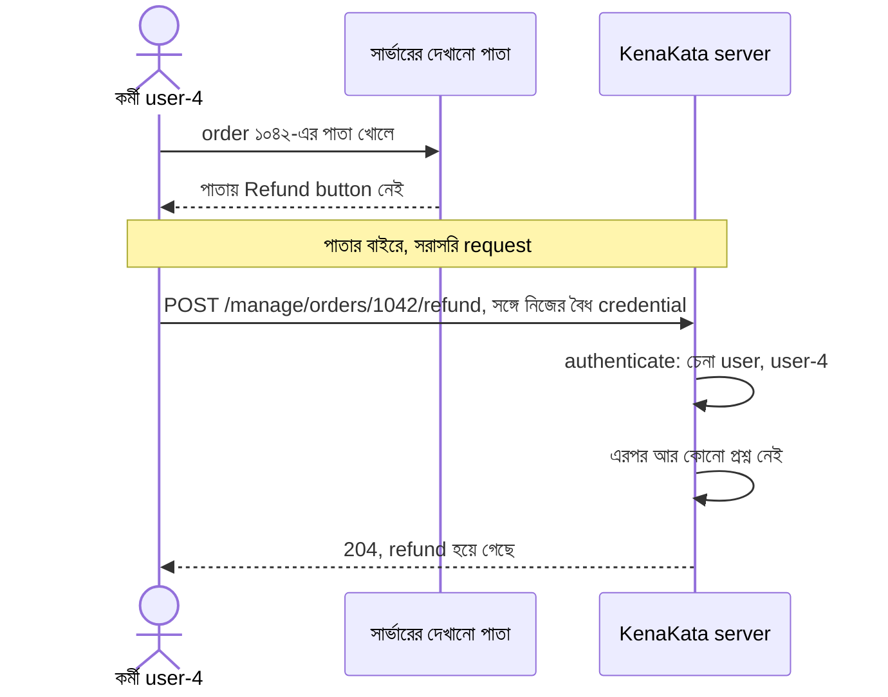
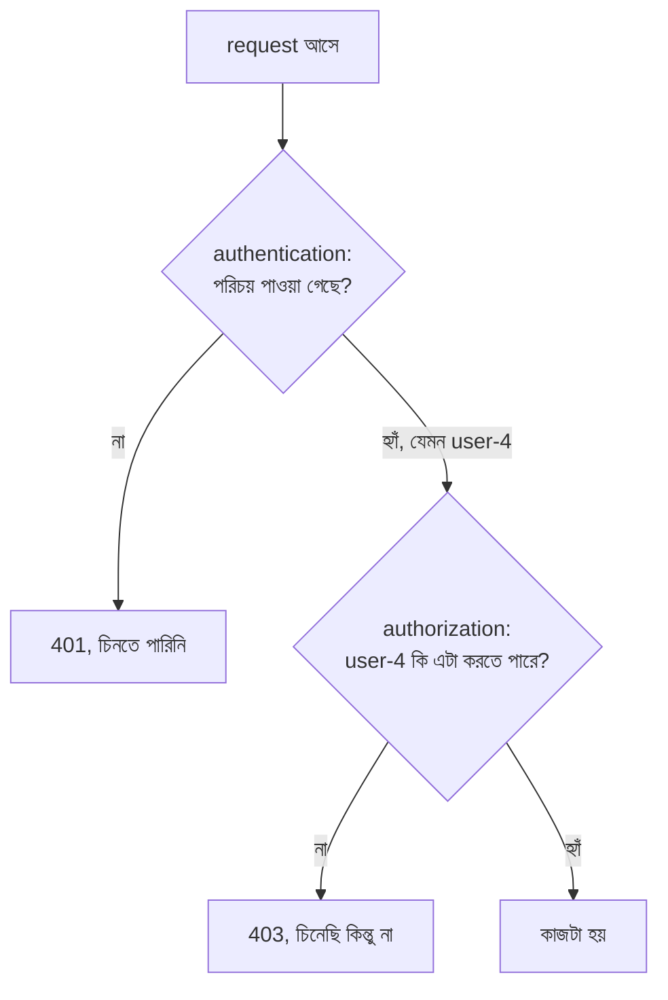
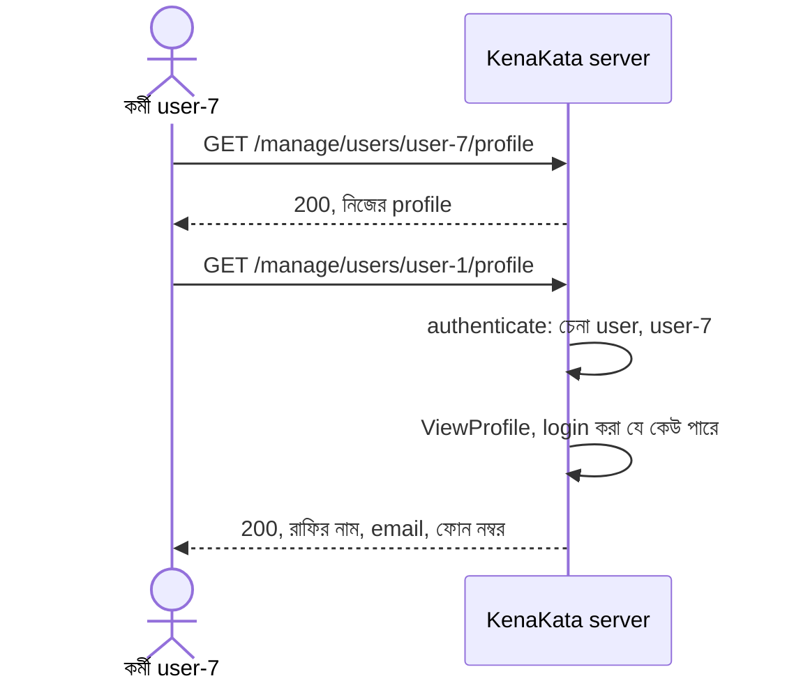
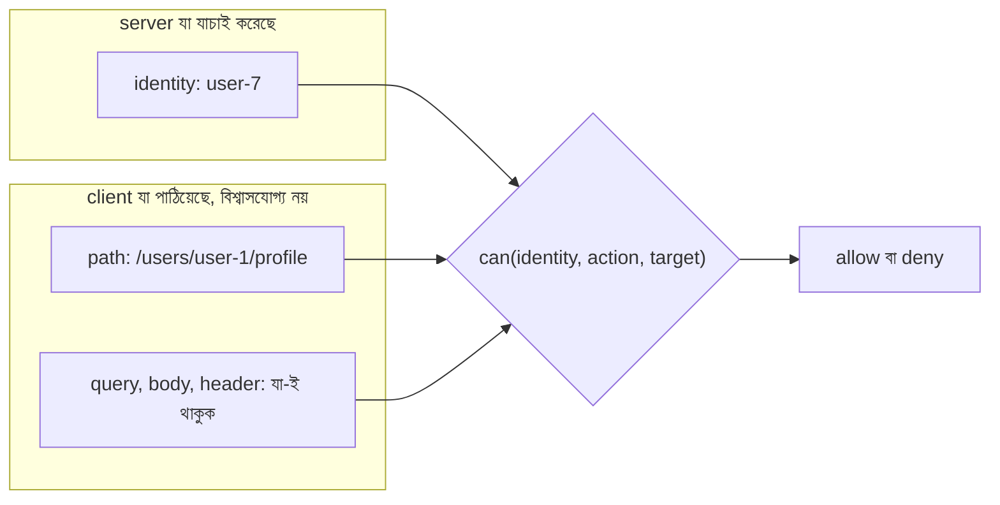
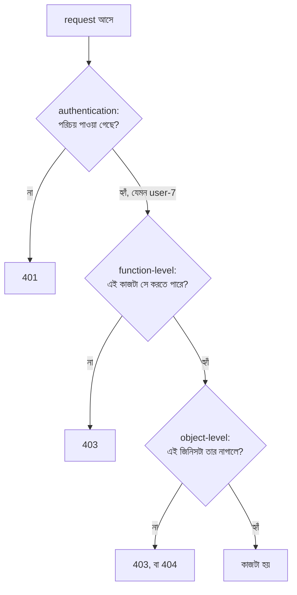

# Authentication বনাম Authorization

নীরার message এল বিকেলে, মাত্র দুই লাইনে।

> রাফি কাল থেকে দুজন কর্মী রাখছে। তারা order দেখবে, order সামলাবে। কিন্তু টাকা ফেরত, মানে refund, শুধু রাফি দেবে।

আরিফ message পড়ে খানিকটা নিশ্চিন্ত হলো। পাঞ্জাবির দামের ঘটনার পর `/manage`-এর সামনে এখন একজন পাহারাদার বসেছে। যে ঢুকছে, তার একটা পরিচয় আছে। তাহলে ভেতরে যারা আছে, তারা তো সবাই রাফির লোক।

"Refund-এর জন্য আলাদা কিছু লাগবে কেন?" সে নিজেকেই জিজ্ঞেস করল।

এই প্রশ্নটা শুনতে নিরীহ। কিন্তু এর ভেতরে একটা ভুল ধারণা লুকিয়ে আছে, যেটা অনেক বড় বড় system-ও বয়ে বেড়ায়: **চেনা মানেই অনুমতি।**

---

## ১. একটা চুক্তি: ধরে নিলাম authentication নির্ভুল

অধ্যায় ১-এ আমরা `authenticate` ফাংশনটা ফাঁকা রেখে এসেছি। ভেতরে কী হবে, সেটা অধ্যায় ৩ আর ৪-এর কাজ। এই অধ্যায়ে সেই ফাঁক ভরব না। তার বদলে একটা thought experiment করব।

> ধরো `authenticate` একদম নির্ভুল। ভুল মানুষকে কখনো ভুল পরিচয় দেয় না। এই আদর্শ অবস্থাতেও কি system নিরাপদ থাকে?

বাস্তবে authentication কখনো নির্ভুল নয়। সেটা অধ্যায় ৩ থেকে ৭ জুড়ে দেখব। তবু এই কল্পনাটা কাজের। কারণ পরিচয় ঠিক থাকলে যে সমস্যাগুলো তবু থেকে যায়, সেগুলো আলাদা করে চেনা যায়। দুটো প্রশ্ন গুলিয়ে ফেললে কোনোটারই উত্তর পরিষ্কার হয় না।

দৃশ্যে এখন তিনজন মানুষ:

| user | কে |
|---|---|
| `user-1` | রাফি, দোকানের মালিক |
| `user-4` | রাফির এক কর্মী |
| `user-7` | রাফির আরেক কর্মী |

---

## ২. আরিফের প্রথম চেষ্টা: "যে ঢুকেছে, সে আমাদের লোক"

আরিফ নতুন কিছু বানাল না। Refund-এর handler যোগ করল `/manage`-এর ভেতরে, অর্থাৎ অধ্যায় ১-এর পাহারাদারের পেছনে:

```go
manage := http.NewServeMux()
manage.HandleFunc("GET /orders", listAllOrders)
manage.HandleFunc("POST /orders/{id}/refund", refundHandler) // নতুন

// অধ্যায় ১-এর মতোই: /manage/-এর নিচে সবকিছু পাহারাদার পেরিয়ে যায়
mux.Handle("/manage/", http.StripPrefix("/manage", requireAuthentication(manage)))
```

```go
func refundHandler(w http.ResponseWriter, r *http.Request) {
	// পাহারাদার পেরিয়ে এসেছে, মানে চেনা মানুষ। তাহলে refund হোক।
	refund(r.PathValue("id")) // refund() এখানে কাল্পনিক
	w.WriteHeader(http.StatusNoContent)
}
```

পরদিন নীরা আরেকটা কথা তুলল: "কর্মীর screen-এ refund button থাকাটাই তো ঠিক না।"

আরিফ template বদলে দিল:

```html
{{if .User.IsOwner}}
  <form method="post" action="/manage/orders/{{.Order.ID}}/refund">
    <button>Refund করো</button>
  </form>
{{end}}
```

এখন দুটো সুরক্ষা। পাহারাদার অচেনা মানুষকে ঠেকায়, আর কর্মী button-ই দেখে না। আরিফের মনে হলো কাজটা শেষ। নীরাও খুশি, রাফিও।

---

## ৩. দুই সপ্তাহ পরে: log এবার "কে" বলল

রাত দশটায় হিসাব মেলাতে বসে রাফি দেখল, ১০৪২ নম্বর order-এর টাকা ফেরত হয়ে গেছে। রাফি নিজে করেনি।

আরিফ log খুলল। এবার উত্তর ছিল:

```
2026-10-19T16:41:22Z refund: order=1042 by=user-4 ip=203.0.113.77
```

(UTC সময়। ঢাকার ঘড়িতে তখন রাত ১০টা ৪১।)

অধ্যায় ১-এর সেই প্রশ্ন, **কে করল?**, এবার প্রথমবার উত্তর পেল। আরিফ এটা পড়ে একবার খুশি হলো। দ্বিতীয়বার পড়ে অস্বস্তিতে পড়ল।

উত্তরটা কোনো অচেনা হ্যাকার নয়। কোনো চুরি-যাওয়া password-ও নয়। Authentication ঠিকঠাকই কাজ করেছে। `user-4` সত্যিই `user-4`। সে রাফির বৈধ কর্মী, বৈধ credential নিয়ে ঢুকেছে, আর এমন একটা কাজ করে ফেলেছে যেটা তার করার কথা ছিল না।

কীভাবে? Refund-এর URL আন্দাজ করা কঠিন নয়: order-এর পাতা `/manage/orders/1042`, তাহলে refund কোথায় হতে পারে? রাফির পাঠানো screenshot, browser-এর developer tools, বা শুধু অনুমান, রাস্তা অনেক। কর্মীর উদ্দেশ্য কৌতূহল ছিল, নাকি হাতের ভুল, সেটা আর জানা যাবে না। আর সেটা আসল প্রশ্নও নয়।

আসল প্রশ্ন হলো, সরাসরি request পাঠানোর পথটা খোলা ছিল কেন?



ছবিতে দেখো, server-এর ভেতরে একটাই প্রশ্ন জিজ্ঞেস করা হয়েছে: "তুমি কে?" উত্তর পেয়েই কাজ শুরু। "তুমি কি এটা করতে পারো?" প্রশ্নটা কেউ করেইনি।

Button কোনো নিয়ম নয়। Button একটা সুবিধা। যে পাতা browser-এ যায়, সেটা user-এর হাতে: সে দেখতে পারে, বদলাতে পারে, বা পাতা না খুলেই সরাসরি request পাঠাতে পারে। নিয়ম শুধু UI-তে থাকলে রাস্তা খুঁজে পাওয়াই যথেষ্ট। অধ্যায় ১-এ দেখেছি, authentication-এর পাহারা বসে server-এ। Authorization-এর পাহারাও বসে server-এ। তবে সেটা একটা আলাদা প্রশ্নের জন্য।

---

## ৪. আসলে দুটো আলাদা প্রশ্ন

রাফির দোকানের কথাই ভাবো। কর্মীকে রাফি চেনে। রোজ দেখে, নাম জানে, হয়তো বিশ্বাসও করে। কিন্তু চেনা আর ক্যাশবাক্সের চাবি দেওয়া দুটো আলাদা সিদ্ধান্ত। মানুষের সম্পর্কে আমরা এ দুটো প্রায়ই গুলিয়ে ফেলি: যাকে চিনি, তাকেই ভরসা করি। Software-এ এই স্বাভাবিক অভ্যাসটাই বিপজ্জনক। Server কাউকে চিনলে সে শুধু জানে মানুষটা কে। মানুষটা কী কী করতে পারবে, সেটা আলাদা করে ঠিক করতে হয়।

> **Authentication** হলো "তুমি কে?" সেটা verify করার প্রক্রিয়া।
>
> **Authorization** হলো "তুমি কি এই কাজটা করতে পারো?" সেটা ঠিক করার প্রক্রিয়া।

| | Authentication | Authorization |
|---|---|---|
| প্রশ্ন | তুমি কে? | তুমি কি এটা করতে পারো? |
| ফল | একটা পরিচয় (`user-4`), বা "চিনতে পারিনি" | অনুমতি আছে, বা নেই |
| কখন | আগে | authentication-এর পরে |
| ব্যর্থ হলে | request-এ বৈধ credential নেই | চেনা গেছে, কিন্তু কাজটা চলবে না |
| HTTP status | সাধারণত `401` | সাধারণত `403` |
| রাফির দোকানে | কর্মী দোকানে ঢুকল | কর্মী ক্যাশবাক্স খুলতে চাইল |

একটা সূক্ষ্ম তফাত আছে। Authentication-এর ফল একটা পরিচয়, যেটা অনেক request জুড়ে একই থাকতে পারে। Authorization-এর ফল একটা **সিদ্ধান্ত**, আর সেটা প্রতিটা নির্দিষ্ট request-এর জন্য। "user-4 কি refund করতে পারে?" আর "user-4 কি order দেখতে পারে?" দুটো আলাদা প্রশ্ন, উত্তরও আলাদা।

সিদ্ধান্তটা আসলে তিনটা জিনিসের ওপর দাঁড়ায়:

- **Subject:** কে চাইছে (`user-4`)
- **Action:** কী করতে চাইছে (`refund`)
- **Resource:** কীসের ওপর (order ১০৪২)

আর ক্রমটা গুরুত্বপূর্ণ। Authorization তার প্রথম ইনপুট পায় authentication-এর কাছ থেকে। "এই user কি refund করতে পারে?" প্রশ্নের কোনো মানে নেই, যদি আগে জানা না থাকে user-টা কে। Authentication ভুল হলে authorization নির্ভুলভাবে ভুল মানুষকে অনুমতি দেবে।

### `401`, `403`, আর `404`

HTTP-র নিয়ম RFC 9110-এ। সেখানে:

- **`401`** মানে request-এ target resource-এর জন্য বৈধ authentication credential নেই (§15.5.2)।
- **`403`** মানে server request বুঝেছে, কিন্তু সেটা পূরণ করতে রাজি নয় (§15.5.4)।
- **`404`** মানে server কোনো current representation পায়নি, **অথবা সেটা আছে বলে জানাতে রাজি নয়** (§15.5.5)। আর `403`-এর আলোচনাতেই RFC বলছে, যে server কোনো resource-এর অস্তিত্ব লুকাতে চায়, সে `403`-এর বদলে `404` দিতে পারে।

নামে একটা ফাঁদ আছে। `401`-এর নাম "Unauthorized", কিন্তু ঘটনাটা মূলত authentication-এর। Authorization-এর "না" আসে `403`-এ। নাম নয়, প্রশ্নটা মনে রাখো: **চিনতে পারিনি, নাকি চিনেছি কিন্তু অনুমতি নেই?**

(`401` response-এ `WWW-Authenticate` header লাগে, সেটা অধ্যায় ১-এ বলা আছে। Browser-এর প্রসঙ্গে সেটা কীভাবে বদলায়, সেটা অধ্যায় ৪-এ আসবে।)



---

## ৫. প্রথম সমাধান: নিয়ম বসবে server-এ, প্রতিটা request-এ

আরিফ এবার নিয়মটা কোডে লিখল। এই অধ্যায়ের জন্য একটা ইচ্ছাকৃত সরল ছক: দোকানে দুই ধরনের মানুষ, মালিক আর কর্মী।

```go
type User struct {
	ID      string
	IsOwner bool // এই অধ্যায়ের সরল ছক। Organization আর role আসবে অধ্যায় ১৫-তে
}

type Action string

const (
	ViewOrders  Action = "orders:view"
	RefundOrder Action = "orders:refund"
)

func can(u User, a Action) bool {
	switch a {
	case ViewOrders:
		return true // পাহারাদার পেরিয়ে আসা যে কেউ
	case RefundOrder:
		return u.IsOwner
	default:
		return false // নিয়মে লেখা নেই মানে অনুমতি নেই
	}
}
```

আর handler-এর সামনে একটা ছোট সহায়ক। `identityKey` আর `Identity` অধ্যায় ১-এর, `loadUser` আর `refund` কাল্পনিক:

```go
// অধ্যায় ১-এর পাহারাদার Identity বসিয়ে গেছে। এখান থেকে পুরো User তুলে আনি।
func userFrom(ctx context.Context) (User, bool) {
	id, ok := ctx.Value(identityKey{}).(Identity)
	if !ok {
		return User{}, false
	}
	return loadUser(id.UserID) // খাতা থেকে: এই user কে, মালিক কি না
}

// authorized দুটো আলাদা প্রশ্ন করে, আর আলাদা উত্তর দেয়
func authorized(w http.ResponseWriter, r *http.Request, a Action) bool {
	u, ok := userFrom(r.Context())
	if !ok {
		http.Error(w, "authentication required", http.StatusUnauthorized) // 401
		return false
	}
	if !can(u, a) {
		log.Printf("denied: user=%s action=%s", u.ID, a) // প্রত্যাখ্যানও রেকর্ড হয়
		http.Error(w, "forbidden", http.StatusForbidden) // 403
		return false
	}
	return true
}

func refundHandler(w http.ResponseWriter, r *http.Request) {
	if !authorized(w, r, RefundOrder) {
		return
	}
	refund(r.PathValue("id"))
	w.WriteHeader(http.StatusNoContent)
}
```

এবার `user-4` সরাসরি `POST /manage/orders/1042/refund` পাঠালে পায় `403`। Button থাকুক বা না থাকুক, তাতে কিছু যায় আসে না। Button এখন শুধু সুবিধা: যে কাজের অনুমতি নেই, সেটা কেন দেখাব। আর log-এ থেকে যায় একটা প্রত্যাখ্যানের রেকর্ড। রাফি জানতে পারবে, কেউ চেষ্টা করেছিল।

### এই কোডের পেছনের নীতিগুলো

এগুলো আরিফের আবিষ্কার নয়। ১৯৭৫ সালে Jerome Saltzer আর Michael Schroeder "The Protection of Information in Computer Systems" নামের একটা লেখায় protection mechanism-এর কয়েকটা design principle দিয়েছিলেন। প্রায় অর্ধশতক পরেও সেগুলো আমাদের ছোট `can` ফাংশনে চেনা চেহারায় ফিরে আসে। সঙ্গে OWASP-এর Authorization Cheat Sheet আর Developer Guide একই কথা আজকের ভাষায় বলে।

- **Deny by default** (Saltzer-Schroeder-এর *fail-safe defaults*)। `can`-এর `default` শাখা এই কাজ করছে। যুক্তিটা চমৎকার: যে system "অনুমতি আছে কি?" দেখে, তার ভুল সাধারণত "না" বলে ফেলে। সেটা তাড়াতাড়ি ধরা পড়ে, কারণ কেউ আটকে গিয়ে অভিযোগ করে। যে system "কী নিষিদ্ধ" তার তালিকা রাখে, তার ভুল "হ্যাঁ" বলে ফেলে। সেটা নিঃশব্দে থেকে যেতে পারে। বন্ধ দরজা চেঁচায়, খোলা দরজা চুপ থাকে।
- **প্রতিটা request-এ check** (*complete mediation*)। আগের request-এ অনুমতি ছিল বলে পরেরটায় ধরে নেওয়া যায় না। OWASP-ও বলে, বেশিরভাগ request-এ ঠিকমতো check করা যথেষ্ট নয়।
- **Least privilege।** মানুষকে ততটুকুই ক্ষমতা, যতটুকু তার কাজের জন্য লাগে। এর একটা উপকার প্রথমে চোখে পড়ে না। কোনোদিন কর্মীর account অন্য কারও হাতে গেলে সে কর্মীর ক্ষমতাটুকুই পাবে, রাফির নয়। Authorization শুধু ভুল আটকায় না, account চুরি হলে ক্ষতির আকারও সীমিত রাখে।
- **নিয়ম এক জায়গায়, আর রেকর্ড রাখা।** OWASP Developer Guide বলে, access-এর সিদ্ধান্ত একটা কেন্দ্রীয় component দিয়ে নিতে হবে, আর authorization-এর ঘটনাগুলো log করতে হবে। নিয়ম প্রতিটা handler-এ ছড়িয়ে থাকলে একটা handler-এ ভুলে গেলেই সেটা ফাঁক।

আরিফ ভাবল, এবার সত্যিই শেষ।

---

## ৬. দ্বিতীয় ফাটল: "এই কাজ" নয়, "এই জিনিস"

এক সপ্তাহ পরে রাফি একটা ছোট অনুরোধ আনল। কর্মীরা নিজেদের ফোন নম্বর আর email নিজেরাই দেখতে চায়, যাতে ভুল থাকলে ঠিক করতে পারে। আরিফ একটা পাতা বানাল:

```
GET /manage/users/{id}/profile
```

নাম, email, ফোন নম্বর। Action-টা যোগ হলো ছোট্ট একটা লাইনে: `ViewProfile`। আর নিয়ম? "যে কেউ নিজের profile দেখবে, সুতরাং login করা যে কেউ পারে।"

```go
case ViewProfile:
	return true // login করা যে কেউ
```

এখানে একটা ভুল আছে, যা কোডে লেখা প্রতিটা অক্ষর ঠিক থাকলেও থাকে। `can`-এর সংজ্ঞা অনুযায়ী "login করা যে কেউ" **profile দেখতে পারে**। কিন্তু আমরা বলতে চেয়েছিলাম, **নিজের** profile। দুটো এক কথা নয়।

`user-7` একদিন নিজের profile পাতা খুলল: `/manage/users/user-7/profile`। URL-এ তার নিজের পরিচয়টা দেখে কৌতূহল হলো। সে শেষের অংশটা বদলে লিখল `user-1`।



Server কিছুই ভুল করেনি, সে নিজের নিয়ম মেনেছে। নিয়মটাই অসম্পূর্ণ ছিল।

এই পর্যন্ত আমরা যে সমস্যা মেটালাম, সেটা **function-level**: "এই কাজটা কি এই মানুষ করতে পারে?" এখন আরেকটা স্তর দেখা গেল, **object-level**: "এই কাজটা কি এই মানুষ **এই নির্দিষ্ট জিনিসের** ওপর করতে পারে?" Profile দেখার কাজটা সবাই পারে, কিন্তু প্রতিটা profile সবার নাগালে নয়।

OWASP-এর API Security Top 10 (2023) এই দুটোকে আলাদা নাম দিয়েছে:

- **Broken Function Level Authorization (BFLA, API5:2023):** কাজ বা endpoint-এ অনুমতি ঠিকমতো যাচাই না করা। আমাদের refund এটা ছিল।
- **Broken Object Level Authorization (BOLA, API1:2023):** ব্যবহারকারীর পাঠানো object-ID ধরে কোনো resource-এ গেলে সেই object-এর ওপর অনুমতি না দেখা। আমাদের profile এটা। অনেকে একই সমস্যাকে পুরোনো নাম IDOR (Insecure Direct Object Reference) বলেও চেনে।

OWASP-এর কথা সংক্ষেপে: যে ফাংশনই user-এর দেওয়া ID দিয়ে data আনে, সেখানেই object-level check ভাবতে হবে। BOLA নিয়ে পুরো আলাদা একটা অধ্যায় আছে (অধ্যায় ১৫), কারণ KenaKata-য় যখন একাধিক organization আসবে, প্রশ্নটা তখন সত্যিকারের ভয়ঙ্কর হয়ে উঠবে। এখানে শুধু প্রথম ফাটলটা চিনে রাখো।

### একই request-এ দুটো ID, দুই রকম ভরসা

এই ঘটনায় একটা গুরুত্বপূর্ণ জিনিস আছে। Request-এ আসলে দুটো ID কাজ করছে, আর দুটো একই মর্যাদার নয়:



**Identity** এসেছে authentication-এর ফল হিসেবে, server-এর নিজের যাচাই থেকে। **Target** (কোন profile) এসেছে client-এর হাত ঘুরে। সেটা যেকোনো কিছু হতে পারে। তাই দুটোকে `can`-এ পাশাপাশি বসিয়ে মেলাতে হয়। আর identity কখনো request-এর কোনো field থেকে নেওয়া চলে না। কেউ যদি পাঠায় `?user_id=user-1`, সেটা "আমি user-1" নয়, সেটা একটা দাবি, যার কোনো প্রমাণ নেই।

---

## ৭. দ্বিতীয় সমাধান: resource-টাকেও প্রশ্নে আনো

আরিফ `can`-এ একটা তৃতীয় প্যারামিটার যোগ করল:

```go
// resourceOwnerID: যার জিনিসটা। যে কাজে নির্দিষ্ট কোনো মালিক নেই, সেখানে ফাঁকা।
func can(u User, a Action, resourceOwnerID string) bool {
	switch a {
	case ViewOrders:
		return true
	case RefundOrder:
		return u.IsOwner
	case ViewProfile:
		return u.IsOwner || u.ID == resourceOwnerID // মালিক সবার, কর্মী শুধু নিজের
	default:
		return false
	}
}
```

আর `authorized`-এ সেই প্যারামিটার পাঠানো, আর profile handler-এ target-টা path থেকে তোলা:

```go
func authorized(w http.ResponseWriter, r *http.Request, a Action, resourceOwnerID string) bool {
	u, ok := userFrom(r.Context())
	if !ok {
		http.Error(w, "authentication required", http.StatusUnauthorized)
		return false
	}
	if !can(u, a, resourceOwnerID) {
		log.Printf("denied: user=%s action=%s target=%q", u.ID, a, resourceOwnerID)
		http.Error(w, "forbidden", http.StatusForbidden)
		return false
	}
	return true
}

func profileHandler(w http.ResponseWriter, r *http.Request) {
	target := r.PathValue("id") // client যা পাঠিয়েছে। বিশ্বাস নয়, মেলানোর জিনিস
	if !authorized(w, r, ViewProfile, target) {
		return
	}
	showProfile(w, target) // showProfile() কাল্পনিক
}
```

`refundHandler`-এ শুধু শেষে একটা ফাঁকা string যোগ হলো: `authorized(w, r, RefundOrder, "")`।

এবার `user-7` যদি `user-1`-এর profile চায়, পায় `403`। রাফি চাইলে সবার profile দেখতে পারে।

নিয়মগুলো যে সত্যি কাজ করছে, সেটা কোড নিজে বলে না। এটা পরীক্ষা করতে হয়, আর শুধু "অনুমতি আছে" দিক নয়, "অনুমতি নেই" দিকটাও। OWASP-এর Authorization Cheat Sheet-ও সেটাই বলে: design-এর সময় যে permission ঠিক করেছ, সেগুলো যে সত্যি প্রয়োগ হচ্ছে, তার জন্য test লেখো।

```go
func TestCan(t *testing.T) {
	owner := User{ID: "user-1", IsOwner: true}
	staff := User{ID: "user-4"}

	tests := []struct {
		name   string
		user   User
		action Action
		target string
		want   bool
	}{
		{"কর্মী order দেখে", staff, ViewOrders, "", true},
		{"কর্মী refund করতে পারে না", staff, RefundOrder, "", false},
		{"মালিক refund করে", owner, RefundOrder, "", true},
		{"কর্মী নিজের profile দেখে", staff, ViewProfile, "user-4", true},
		{"কর্মী অন্যের profile দেখতে পারে না", staff, ViewProfile, "user-7", false},
		{"নিয়মে নেই এমন action", owner, Action("orders:delete"), "", false},
	}
	for _, tc := range tests {
		if got := can(tc.user, tc.action, tc.target); got != tc.want {
			t.Errorf("%s: got %v, want %v", tc.name, got, tc.want)
		}
	}
}
```

শেষ test-টা লক্ষ্য করো। নিয়মের তালিকায় নেই এমন একটা action মালিকের জন্যও `false` পায়। Deny by default-এর পরীক্ষা এভাবেই হয়।

সব মিলিয়ে একটা request এখন এই পথ পেরোয়:



---

## ৮. Threat model: যে আক্রমণকারী আগে থেকেই ভেতরে

অধ্যায় ১-এর threat model-এ আক্রমণকারী ছিল বাইরের, অচেনা। এই অধ্যায়ে আক্রমণকারী **authenticated**। সে বৈধ credential নিয়ে ভেতরে ঢুকেছে। দুটো চেহারায় তাকে ভাবা যায়:

1. **কর্মী নিজে**: কৌতূহল, ভুল, বা কোনোদিন ক্ষোভ।
2. **চুরি-যাওয়া কর্মীর account**: অন্য কেউ ওই কর্মীর পরিচয় পেয়ে গেছে। (কীভাবে, সেটা অধ্যায় ৩ থেকে ৭-এর গল্প।)

| প্রশ্ন | কর্মী নিজে | চুরি-যাওয়া কর্মীর account |
|---|---|---|
| কী control করে? | নিজের বৈধ credential, আর request-এর প্রতিটা অংশ: path, query, body | অন্য কারও দেওয়া একই জিনিস, কিন্তু আসল কর্মীর অজান্তে |
| কী observe করে? | URL-এর ধরন, ID-র ছাঁদ, response, আর error-এর তফাত (`403` বনাম `404`) | একই, সঙ্গে কর্মীর দেখা সব পাতা |
| কী modify করে? | path-এর ID, body-র field, HTTP method | একই |
| কী replay করে? | একটা বৈধ request হুবহু, বা ID বদলে বারবার | একই |
| Credential ফাঁস হলে ক্ষতি? | (নিজেরটা) ক্ষতি = ওই user-এর authorization-এর পরিধি | ক্ষতি = ওই account-এর পরিধি। Check ঠিক থাকলে তার বেশি নয়। এখানেই least privilege-এর দাম |
| কতক্ষণ access? | যতক্ষণ তার ক্ষমতা আছে। কর্মী ছাড়ানো মানে ক্ষমতা তুলে নেওয়া | যতক্ষণ না credential বা তার state বাতিল হয় (অধ্যায় ১৪) |
| Server কি ধরতে পারে? | আংশিক। প্রত্যাখ্যান log-এ থাকে, আর পরপর ID ঘুরিয়ে বহু `403` একটা probing-এর ছাপ। কিন্তু ভুল করে **অনুমতি দিয়ে ফেলা** request নিঃশব্দ, দেখতে বৈধ | কঠিন। বৈধ credential দিয়ে বৈধ-দেখতে কাজ, আলাদা করা যায় না |
| Server কি revoke করতে পারে? | Permission বদলানো যায়। কিন্তু চলতে থাকা login-এর কী হবে, সেটা অধ্যায় ১৪ | Credential বদলানো (অধ্যায় ৩), চলতে থাকা state বাতিল (অধ্যায় ১৪) |
| ক্ষতি কীভাবে সীমিত হয়? | Least privilege, deny by default, কেন্দ্রীয় check, প্রত্যাখ্যানের log | একই, আর সংবেদনশীল কাজে আলাদা ধাপ (অধ্যায় ২২) |

এই table-এর একটা সারি আলাদা করে ভাবার মতো: "ভুল করে অনুমতি দিয়ে ফেলা request নিঃশব্দ।" Authorization-এর ব্যর্থতা কোনো error দেয় না। সব ঠিকঠাক দেখায়, response `200`, log-এ কোনো আওয়াজ নেই। তাই authentication-এর চেয়ে authorization-এর ভুল প্রায়ই বেশিদিন টিকে থাকে।

---

## ৯. Trade-off

এই সমাধানেরও দাম আছে।

- **প্রতিটা নতুন endpoint-এ মনে রাখতে হয়।** Check ভুলে গেলে কোনো error আসে না, endpoint নিঃশব্দে খোলা থেকে যায়। এই ঝুঁকি কমাতে নিয়মটা এমনভাবে বসাতে হয় যাতে ভুলে গেলে ফল "না" হয়। এখানেই deny by default আর কেন্দ্রীয় check-এর দাম আর দরকার, দুটোই। তবু যে handler কখনো `authorized` ডাকেইনি, তাকে কোনো `default` শাখা বাঁচায় না। সেই ফাঁক আটকাতে হয় পদ্ধতি দিয়ে: code review, test, আর অধ্যায় ১-এর "পুরো subtree মুড়ে দেওয়ার" কৌশলের মতো কাঠামো দিয়ে।
- **নিয়ম বাড়ে।** আজ রাফি আর কর্মী, দুই ধরন। কাল আরও মানুষ আর আরও কাজ এলে `IsOwner` একটা bool দিয়ে আর চলবে না। এটা ইচ্ছে করেই সরল রাখা হয়েছে। Role আসবে অধ্যায় ১৫-তে।
- **নিরাপত্তা আর কাজের গতির টানাপোড়েন।** কর্মী একদিন বলবে, "রাফি নেই, একটা refund এখনই দরকার।" এখানে Saltzer-Schroeder-এর আরেকটা principle খেটে যায়: *psychological acceptability*। মানুষ বাধা পেলে পাশ কাটায়। কর্মীর কাজ আটকে গেলে সে রাফির login ধার চাইবে। তখন কী হয়? Log-এ দেখাবে `by=user-1`, কিন্তু কাজটা করেছে `user-4`। অধ্যায় ১-এর accountability আবার শূন্যে ফিরে যায়। নিরাপত্তার নিয়ম যদি দৈনন্দিন কাজে এতটাই বাধা হয় যে লোকে সেটা এড়িয়ে চলতে শুরু করে, তাহলে নিয়মটা কাগজে আছে, বাস্তবে নেই। কে কতটা ক্ষমতা পাবে, সেটা তাই শুধু প্রযুক্তির সিদ্ধান্ত নয়, একটা ব্যবসায়িক সিদ্ধান্তও।
- **`403` নাকি `404`।** `403` বললে `user-7` জানতে পারে, `user-1` নামে একজন আছে আর তার একটা profile আছে। কিছু system তাই লুকাতে `404` দেয়, আর RFC সেটা স্পষ্ট করেই অনুমতি দেয়। কিন্তু লুকালে ডিবাগ কঠিন হয়: ভুল পথে এসেছে, নাকি অনুমতি নেই, বোঝা যায় না। না লুকালে একটা তথ্য বেরিয়ে যায়: এই ID-টা আছে। এই অধ্যায়ে `403` রেখেছি, কারণ দুটো প্রশ্ন পরিষ্কার দেখাতে চাই। বহু organization-এর যুগে এই সিদ্ধান্ত আবার ভাবতে হবে (অধ্যায় ১৫)।
- **খরচ।** প্রতিটা request-এ user লোড করা, check করা। সাধারণত সামান্য, কিন্তু শূন্য নয়।

---

## ১০. এই সমাধান কী সমাধান করে না

- **ভুল মানুষকে চেনা।** Authorization ধরে নেয় authentication ঠিক আছে। কেউ `user-4`-এর পরিচয় নিয়ে ঢুকে পড়লে `can` তাকে `user-4`-ই ভাববে। পরিচয় ঠিকভাবে চেনা আমাদের এখনো বাকি: password, session, আর তাদের ভাঙন নিয়ে অধ্যায় ৩ থেকে ৭।
- **"এই user কি সত্যিই এটা করতে চেয়েছিল?"** Authorization জিজ্ঞেস করে, user কি কাজটা করতে *পারে*। জিজ্ঞেস করে না, সে কি কাজটা করতে *চেয়েছিল*। রাফি নিজে অনুমতিপ্রাপ্ত। কিন্তু যদি অন্য কোনো পাতা রাফির browser দিয়ে তার অজান্তে refund-এর request পাঠিয়ে দেয়? `can(রাফি, Refund)` হ্যাঁ বলবে, কারণ সত্যিই রাফির সেই অনুমতি আছে। এই গল্প অধ্যায় ৬-এ (CSRF)।
- **অনুমতি বদলে গেলে।** রাফি যদি কাল কর্মীকে ছাড়িয়ে দেয়, তার চলতে থাকা login-এর কী হবে? Logout আর revocation নিয়ে অধ্যায় ১৪।
- **একাধিক organization-এর সীমানা।** আজ একটাই দোকান, তাই "এই order কার" প্রশ্নটা চাপা আছে। Organization এলে এটাই আসল সমস্যা হবে। অধ্যায় ১৫।
- **সবচেয়ে সংবেদনশীল কাজ।** Refund-এর জন্য শুধু "মালিক" হওয়া যথেষ্ট কি না, সেই প্রশ্ন এখন তুলছি না। আজ রাফির login থাকাই রাফি হওয়ার প্রমাণ। সংবেদনশীল কাজে আরেক ধাপ চাওয়া অনেক পরে, অধ্যায় ২২-এ। (Saltzer-Schroeder-এর *separation of privilege* ধারণা, "দুটো চাবি", সেখানেই ফিরে আসবে।)
- **বৈধ ক্ষমতার অপব্যবহার।** রাফি নিজে ভুল refund দিলে বা মন্দ উদ্দেশ্যে দিলে `can` বাধা দেবে না। এটা আর authorization-এর সমস্যা নয়, ব্যবসার নজরদারির।
- **Route-এ পাহারা না থাকা।** কোনো handler-এ `authorized` ডাকতে ভুলে গেলে সেটা খোলা থাকবে। কোডের কাঠামো আর test সেই ঝুঁকি কমায়, শূন্য করে না।

---

## ১১. সাধারণ ভুল ধারণা

**"Login আছে মানে অনুমতি আছে।"** Login শুধু বলে server আপনাকে চেনে। আপনি কী করতে পারেন, সেটা আলাদা সিদ্ধান্ত।

**"UI-তে button না দেখালেই হলো।"** Button একটা সুবিধা। যে request browser পাঠায়, সেটা `curl`-ও পাঠাতে পারে। নিয়ম থাকে server-এ।

**"ID অনুমান করা কঠিন হলে (যেমন UUID), তাহলে IDOR/BOLA হবে না।"** Unguessable ID অনুমানের পথ কঠিন করে, কিন্তু access check-এর বিকল্প নয়। ID ফাঁস হয় নানা পথে: log, shared link, browser history, API-র অন্য response। অধ্যায় ১-এর "গোপন URL"-এর সেই একই গল্প। যেখানে গোপনীয়তাই একমাত্র সুরক্ষা, সেখানে ফাঁস হলেই সব শেষ।

**"`401` মানে authorization ব্যর্থ, `403` মানে ভুল password।"** উল্টো। `401` মূলত "চিনতে পারিনি", `403` "চিনেছি, কিন্তু না"।

**"Client যে user ID পাঠায়, সেটাই 'আমি'।"** Identity আসে server-এর নিজের যাচাই থেকে। Request-এর কোনো field থেকে নয়। Client-এর পাঠানো ID সবসময় একটা দাবি।

**"কাজের স্তরে (`/manage`-এ ঢোকা) check করলেই object-ও সুরক্ষিত।"** Function-level আর object-level আলাদা দুটো প্রশ্ন। প্রথমটা ঠিক থাকলেও দ্বিতীয়টা ভাঙা থাকতে পারে, যেমন profile-এর ঘটনায়।

**"Authorization একবার ঠিক করলেই হলো।"** আজ যে পারে, কাল সে নাও পারতে পারে। সিদ্ধান্ত প্রতিটা request-এ নতুন করে নিতে হয়, আর সেই সিদ্ধান্তের উপাদান (কে কী পারে) বদলাতে পারে।

---

## ১২. এক নজরে: Authorization

| প্রশ্ন | উত্তর |
|---|---|
| এটা কী? | Subject, action, resource মিলিয়ে নেওয়া সিদ্ধান্ত: এই কাজটা কি অনুমোদিত? |
| কেন এসেছে? | পরিচয় জানা মানেই সবকিছুর অনুমতি নয়। ক্ষমতার ভাগ না থাকলে প্রতিটা বৈধ user সবকিছু পারে |
| কী সমাধান করে? | কর্মী আর মালিকের ক্ষমতার ফারাক, নিজের জিনিস আর অন্যের জিনিসের ফারাক, আর account চুরি গেলে ক্ষতির সীমা |
| কী সমাধান করে না? | ভুল পরিচয়, user-এর "চাওয়া"-র প্রশ্ন (CSRF), চলতে থাকা login বাতিল, একাধিক organization-এর সীমানা, বৈধ ক্ষমতার অপব্যবহার (§১০) |
| কোথায় থাকে? | Server-এ, প্রতিটা protected কাজের ঠিক আগে। UI-তে নয় |
| কে ব্যবহার করে? | Server। Client শুধু কিছু চায়, সিদ্ধান্ত নেয় না |
| কীভাবে আক্রান্ত হয়? | Check ভুলে যাওয়া (BFLA), user-এর পাঠানো ID-র ওপর ভরসা (BOLA), UI-র ওপর নির্ভরতা, client থেকে আসা identity-র ওপর ভরসা |
| ভেঙে পড়লে ক্ষতি? | ভাঙা অংশ যত বড়, ক্ষতিও তত। আর ভাঙাটা নিঃশব্দ, তাই বেশিদিন টিকে যেতে পারে |
| মেয়াদ (lifetime)? | সিদ্ধান্ত প্রতি request-এ নতুন। যে data-র ওপর সিদ্ধান্ত দাঁড়ায় (কে কী পারে), সেটা দীর্ঘস্থায়ী |
| বাতিল (revocation)? | Permission বদলানো সহজ। চলতে থাকা login বাতিল আলাদা সমস্যা (অধ্যায় ১৪) |
| বিকল্প? | ACL, role-based, attribute/policy-based, capability-ভিত্তিক। শুধু নাম এখানে। KenaKata-র জন্য role-based আসবে অধ্যায় ১৫-তে |
| কখন লাগে? | যখনই সবার জন্য খোলা নয় এমন কাজ বা তথ্য থাকে |
| কখন লাগে না? | যে অংশ ইচ্ছা করেই সবার জন্য খোলা, যেমন `GET /products`। তবে সেটা সচেতন সিদ্ধান্ত হওয়া চাই |
| Production trade-off? | প্রতিটা endpoint-এ মনে রাখার দায়, নিয়মের জটিলতা, কাজের গতির সঙ্গে টানাপোড়েন, `403` বনাম `404`-এর তথ্য ফাঁস, test-এর বোঝা |

---

## আমরা কী শিখলাম? (What did we learn?)

- Authentication হলো "তুমি কে?"। Authorization হলো "তুমি কি এই কাজটা করতে পারো?"। দুটো আলাদা প্রশ্ন, আর authorization-এর ইনপুট authentication-এর ফল।
- Authorization একটা সিদ্ধান্ত, তিনটা জিনিসের ওপর: subject, action, resource। পরিচয় জানা মানে তার একটা মাত্র অংশ জানা।
- Authentication নির্ভুল হলেও system ভাঙতে পারে। "কে করল?" প্রশ্নের উত্তর আর "করার কথা ছিল কি?" প্রশ্নের উত্তর এক নয়।
- Function-level (এই কাজটা পারো?) আর object-level (এই জিনিসটার ওপর পারো?) দুটো আলাদা স্তর। OWASP-এর ভাষায় BFLA আর BOLA।
- নিয়ম থাকে server-এ, প্রতিটা request-এ। Deny by default, least privilege, একটা কেন্দ্রীয় জায়গা, আর প্রত্যাখ্যানের রেকর্ড।
- Identity আসে server-এর যাচাই থেকে। Request-এ আসা ID সবসময় একটা দাবি, যা মেলাতে হয়।
- `401` মানে চিনতে পারিনি, `403` মানে চিনেছি কিন্তু অনুমতি নেই, আর `404` কখনো কখনো "আছে, কিন্তু বলব না"।
- Authorization-এর ভুল নিঃশব্দ। তাই তার পরীক্ষা করতে হয় ইচ্ছাকৃতভাবে, "না" বলার দিকটাতেও।
- নিরাপত্তা-নিয়ম যদি কাজে এতটাই বাধা দেয় যে মানুষ পাশ কাটায়, তাহলে নিয়মটা কাগজেই থাকে।

## পাঁচ মিনিটের পরীক্ষা

নিজের কোনো project-এর staging-এ ক্ষমতায় সবচেয়ে নিচের একটা user দিয়ে সবচেয়ে সংবেদনশীল তিনটা endpoint-এ সরাসরি `curl` পাঠাও, UI একবারও না খুলে। কী আসে? `403`, নাকি সফল response?

তারপর একই user দিয়ে একটা URL-এর ID বদলে অন্য কারও ID বসাও। তারপর log খুলে দেখো: প্রত্যাখ্যানগুলো কি সেখানে আছে, নাকি সব চুপ?

## একটা অস্বস্তিকর প্রশ্ন (One uncomfortable question)

এই অধ্যায়ের প্রতিটা সিদ্ধান্ত একটা জিনিসের ওপর দাঁড়িয়ে ছিল: পরিচয়। `can(user-4, ...)` জানে `user-4` কে, কারণ authentication তাকে বলে দিয়েছে। সেই authentication-এর প্রমাণ এখন পর্যন্ত একটা: password।

আরিফ সেই password-গুলো database-এ রাখবে। একদিন সেই database যদি কোনোভাবে বেরিয়ে যায়?

**যে password দিয়ে "আমিই সে" প্রমাণ হয়, সেটা যদি আক্রমণকারীর হাতে চলে যায়, তাহলে `can`-এর সবচেয়ে নিখুঁত নিয়মও কাকে ঠেকাবে?**

---

## পরের অধ্যায়

[অধ্যায় ৩: প্রথম Login System এবং Password Security](../03-password-security/README.md)। আরিফ email আর password দিয়ে প্রথম login বানায়। তারপর একদিন database-টা ফাঁস হয়।

---

## তথ্যসূত্র

- [RFC 9110: HTTP Semantics](https://www.rfc-editor.org/rfc/rfc9110): `401` (§15.5.2), `403` (§15.5.4), `404` (§15.5.5)
- [OWASP Authorization Cheat Sheet](https://cheatsheetseries.owasp.org/cheatsheets/Authorization_Cheat_Sheet.html): least privilege, deny by default, প্রতিটা request-এ permission যাচাই, permission-এর test
- [OWASP Developer Guide: Enforce Access Controls](https://devguide.owasp.org/04-design/02-web-app-checklist/07-access-controls): কেন্দ্রীয় component, authorization ঘটনার log, authorization শেষ হলে session শেষ
- [OWASP API Security Top 10 2023](https://owasp.org/API-Security/editions/2023/en/0x11-t10/): API1:2023 BOLA, API5:2023 BFLA
- Jerome H. Saltzer, Michael D. Schroeder, *The Protection of Information in Computer Systems*, Proceedings of the IEEE, 63(9), 1975: fail-safe defaults, complete mediation, least privilege, separation of privilege, psychological acceptability

## লেখার অবস্থা

- [x] Draft
- [ ] Technical review
- [ ] Security review
- [ ] Published