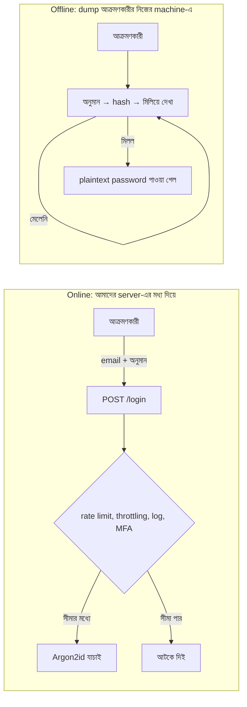
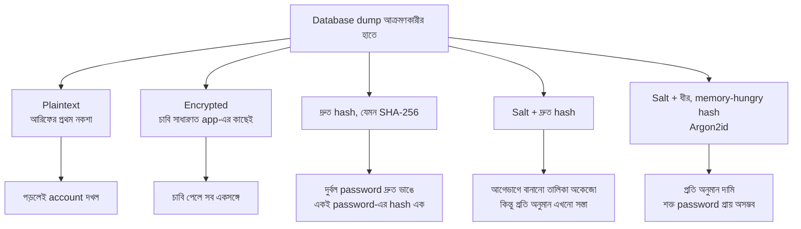
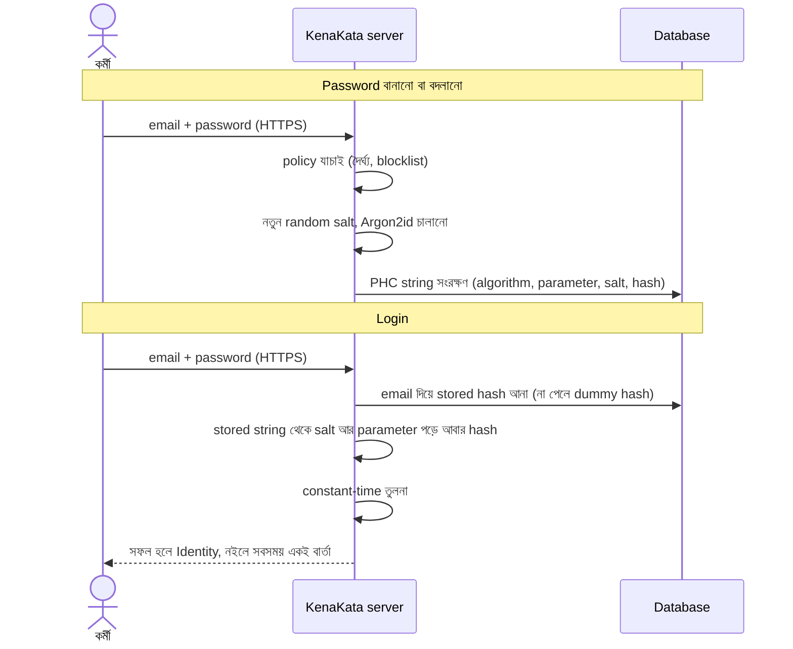

# প্রথম Login System এবং Password Security

বৃহস্পতিবার ভোর, ৬টা ৪০। আরিফের ফোনে একটা অচেনা মানুষের email এল।

> **বিষয়:** আপনাদের database backup ইন্টারনেটে খোলা
>
> ভাই, আমি শখে security নিয়ে ঘাঁটাঘাঁটি করি। একটা public link-এ `kenakata-backup.sql.gz` নামে একটা ফাইল পেলাম। ভেতরে "kenakata" নামটা আছে, তাই লিখছি। সময় পেলে দেখে নেবেন।

আরিফের ঘুম পুরোপুরি কাটল না, কিন্তু মনে পড়ল। তিন সপ্তাহ আগে সে একটা backup নিয়ে একজন বন্ধুকে migration দেখিয়েছিল। ফাইলটা পাঠিয়েছিল "যার কাছে লিঙ্ক আছে সে-ই দেখতে পারবে" ধরনের share link দিয়ে। লিঙ্কটা শেষ পর্যন্ত কোথায় কোথায় গেল, তার হিসাব তার কাছে নেই।

অধ্যায় ১-এর গোপন URL মনে আছে? "যার কাছে আছে, সে-ই সব"। সেই ভুলটাই আরেকটা চেহারায় ফিরে এসেছে।

আরিফ ফাইলটা নামাল। `users` table-এ একটা query চালাল। পাঁচ সেকেন্ড পরে সে বুঝল, সমস্যা ফাইলটা বাইরে যাওয়ায় যতটা, তার চেয়ে বেশি ফাইলের ভেতরে যা ছিল তাতে।

---

## ১. তিন সপ্তাহ আগে: আধ ঘণ্টার login

অধ্যায় ১-এ আরিফ `authenticate` ফাংশনটা ফাঁকা রেখেছিল। অধ্যায় ২-এ আমরা ধরে নিয়েছিলাম সেটা নির্ভুল। কিন্তু কোনো একসময় ভেতরটা লিখতে হয়েছে, আর আরিফ সেটা লিখেছিল যেভাবে ব্যস্ত মানুষ লেখে: সবচেয়ে সোজা পথে।

দুটো জিনিস দরকার ছিল। রাফি আর তার দুই কর্মীর email ও password রাখার জায়গা, আর অধ্যায় ১-এর সেই `verifyPassword` ফাংশন, যেটা বলে দেয় "এই email-password জোড়া ঠিক কি না"।

| id | email | password |
|---|---|---|
| `user-1` | `rafi@example.com` | `rafi1985` |
| `user-4` | `shuvo@example.com` | `shuvo@123` |
| `user-7` | `tuli@example.com` | `Tuli2024!` |

(email আর password কাল্পনিক, আর ইচ্ছা করেই দুর্বল।)

```go
// আরিফের প্রথম সংস্করণ। কাজ করে, কিন্তু ভুল। কেন ভুল, সেটা সামনে।
func verifyPassword(email, pw string) (Identity, bool) {
	var id, stored string
	err := db.QueryRow(
		"SELECT id, password FROM users WHERE email = $1", email,
	).Scan(&id, &stored)
	if err != nil || stored != pw {
		return Identity{}, false
	}
	return Identity{UserID: id}, true
}
```

(`db` আর `Identity` আগের অধ্যায়ের কাল্পনিক অংশ। query-তে `$1` ব্যবহার হয়েছে, মানে user-এর পাঠানো email সরাসরি SQL-এর ভেতরে বসানো হয়নি। সেটা আলাদা একটা ঝুঁকি, আর এখানে ঠিকই আছে।)

আরিফ test করল। ঠিক password দিলে ঢোকে। ভুল দিলে ঢোকে না। আধ ঘণ্টা, কাজ শেষ। কোডে "ভুল" বলে কিছু চোখে পড়ে না।

এটাই এই অধ্যায়ের প্রথম শিক্ষা, আর এটা একটু অস্বস্তিকর: **এই কোড প্রতিটা functional test পাস করে, তবু নিরাপত্তার দিক থেকে ভাঙা।** Functional test জিজ্ঞেস করে "ঠিক মানুষ ঢুকছে তো?"। নিরাপত্তার প্রশ্ন আলাদা: "জিনিসটা অন্যের হাতে গেলে কী হবে?"

---

## ২. ফাঁস: dump খুললে আরিফ কী দেখল

```sql
SELECT id, email, password FROM users;
```

```
 id     | email             | password
--------+-------------------+-----------
 user-1 | rafi@example.com  | rafi1985
 user-4 | shuvo@example.com | shuvo@123
 user-7 | tuli@example.com  | Tuli2024!
```

আক্রমণকারীকে কিছু ভাঙতে হয়নি। তার দরকার ছিল শুধু ফাইলটা পড়া।

আরিফ ক্ষতিটা গুনতে বসল। চারটা আলাদা ক্ষতি, আর প্রতিটা আলাদা ধরনের।

**এক: তিনটা account এক মুহূর্তে দখল।** আর অধ্যায় ২-এর শেষ প্রশ্নের উত্তরও এখানেই: "যে password দিয়ে 'আমিই সে' প্রমাণ হয়, সেটা আক্রমণকারীর হাতে গেলে `can`-এর সবচেয়ে নিখুঁত নিয়ম কাকে ঠেকাবে?" উত্তর: **কাউকে না।** `can(user-1, RefundOrder)` সত্যিই `true` দেবে, কারণ রাফির সেই অনুমতি আছে, আর আক্রমণকারী এখন রাফি। Authorization পরিচয়কে বিশ্বাস করে। পরিচয়ের credential চুরি হলে সেই বিশ্বাসই আক্রমণের রাস্তা।

**দুই: ক্ষতি KenaKata-র বাইরেও যায়।** মানুষ গড়ে অনেকগুলো account চালায়, আর মনে রাখার সীমা আছে। তাই একই password বা তার সামান্য বদলানো রূপ বারবার ফিরে আসে। `shuvo@123` যদি শুভর email-এও থাকে, তাহলে KenaKata-র ফাঁস তার email দখলের চাবি। আর email দখল মানে "password ভুলে গেছি" লিঙ্ক দিয়ে আরও অনেক দরজা খোলা। অধ্যায় ১-এ আমরা বলেছিলাম recovery একটা নতুন দরজা। এখানে সেই দরজার সামনে চাবি পড়ে আছে।

**তিন: আরিফ নিজেও password পড়তে পারে।** আর পারে এমন সবাই: database administrator, যে freelancer backup পেয়েছে, যে কর্মী log বা screenshot ঘেঁটেছে। কেউ খারাপ কিছু না করলেও ক্ষমতাটা থেকে যায়। যে system user-এর password "দেখিয়ে দিতে" পারে, তার ভেতরে সবসময় ভুল একটা নকশা লুকিয়ে আছে। এই লক্ষণটা মনে রেখো, পরে কাজে লাগবে।

**চার: accountability আবার ভাঙল।** অধ্যায় ১-এ আমরা log-এ `by=user-4` বসিয়ে "কে করল?" প্রশ্নের উত্তর পেয়েছিলাম। কিন্তু আক্রমণকারী `user-4`-এর পরিচয়ে ঢুকলে log-এ সেই একই `by=user-4` লেখা হবে। Log ঠিকঠাক কাজ করবে, আর মিথ্যে বলবে।

আরও একটা জিনিস আরিফ লক্ষ করল, যদিও সেটা এই অধ্যায়ের বিষয় নয়। Dump-এ শুধু password নেই। ক্রেতাদের নাম, ফোন নম্বর, ঠিকানাও আছে। Password ঠিকমতো রাখলে এগুলো সুরক্ষিত হয় না। এটা পরের তালিকায় (§১২) ফিরে আসবে।

### এখন আক্রমণকারী কোথায়?

এই ঘটনা একটা মৌলিক জিনিস বদলে দেয়। এতদিন আমরা আক্রমণকারীকে ভেবেছি **আমাদের server-এর সামনে** দাঁড়ানো কেউ হিসেবে। সে `/login`-এ অনুরোধ পাঠায়, আর আমরা সেখানে নিয়ম বসাতে পারি: কতবার ভুল করা যাবে, কত দ্রুত, কোন IP থেকে। এটাকে বলে **online** আক্রমণ।

কিন্তু dump হাতে এলে আক্রমণকারী আমাদের server-এর **বাইরে**। সে নিজের machine-এ, নিজের সময়ে, যত খুশি অনুমান করতে পারে। কেউ তার গতি বাঁধবে না, কোনো log তৈরি হবে না, আমরা জানতেও পারব না। এটা **offline** আক্রমণ।

এই পার্থক্য ছবিতে দেখা যাক। প্রশ্নটা হলো: আমাদের কোন নিয়ন্ত্রণ কোন আক্রমণে কাজ করে?



ডানদিকের বাক্সে আমাদের কোনো নিয়ন্ত্রণ নেই। Rate limit সেখানে পৌঁছায় না, MFA-ও না। সেখানে একটাই জিনিস আক্রমণকারীকে আটকায়: **প্রতিটা অনুমানের খরচ।** পুরো অধ্যায়ের নকশা এই এক বাক্যের ওপর দাঁড়িয়ে। আজ যা বানাব, তার উদ্দেশ্য সেই খরচ বাড়ানো, আর তার সঙ্গে online দিকটাও সামলানো।

---

## ৩. ভুল প্রশ্ন: "password কীভাবে লুকাব?"

আরিফের প্রথম প্রতিক্রিয়া ছিল স্বাভাবিক: "ঠিক আছে, password-গুলো encrypt করে রাখি।"

শুনতে ঠিক লাগে। কিন্তু একটু থামো। Encryption মানে দুমুখী পথ: চাবি দিয়ে তালা দেওয়া যায়, চাবি দিয়ে খোলাও যায়। Login-এর সময় server-কে আসল password মেলাতে হলে চাবিটা তার হাতের কাছেই থাকতে হয়: environment variable, config ফাইল, বা secret manager। Dump-এর সঙ্গে চাবি আসে না, সেটা ঠিক। কিন্তু যে আক্রমণ database পর্যন্ত পৌঁছায়, সে প্রায়ই application server-ও ছোঁয়। পুরোনো backup-এর সঙ্গে config থেকে যায়, ভুলে commit হওয়া `.env` থেকে যায়। চাবি একবার হাতে এলে সব password একসঙ্গে খোলে।

তবে আসল সমস্যা এর আরও গভীরে, আর সেটা প্রশ্নের গোড়ায়। আরিফ জিজ্ঞেস করছিল "password কীভাবে লুকাব?"। ঠিক প্রশ্নটা হলো: **server-কে কি আসলেই password জানতে হয়?**

না। Server-এর কাজ password **মনে রাখা** নয়। কাজ হলো কেউ password দিলে বলা, "এটা সেই password-ই কি না।" মনে রাখা আর চেনার মধ্যে পার্থক্যটা সূক্ষ্ম, কিন্তু পুরো নকশা এর ওপর দাঁড়িয়ে। Encryption এমন কিছু করে যা আমাদের দরকারই নেই: আসল password ফিরিয়ে আনার ক্ষমতা। OWASP-ও বলে, password-এর ক্ষেত্রে encryption দরকার হয় শুধু বিরল পরিস্থিতিতে, যেমন অন্য কোনো system-এ ওই password দিয়েই ঢুকতে হলে।

আগের অংশের সেই লক্ষণটা মনে করো: যে system password "দেখিয়ে দিতে" পারে, সে ভুল জিনিস রাখছে। সঠিক নকশায় রাফি password ভুলে গেলে আরিফও বলতে পারবে না সেটা কী ছিল। তখন নতুন একটা বানাতে হবে। প্রথমে এটা অসুবিধা মনে হয়। আসলে এটাই প্রমাণ যে ব্যবস্থাটা ঠিক জায়গায় আছে।

### Hash: একমুখী পথ

**Hash function** যেকোনো input নিয়ে একটা নির্দিষ্ট দৈর্ঘ্যের ফল দেয়। দুটো গুণ আমাদের কাজে লাগে:

- একই input সবসময় একই ফল দেয়। তাই পরে তুলনা করা যায়।
- ফল থেকে input ফিরিয়ে আনার সোজা কোনো পথ নেই।

তাহলে আমরা password রাখব না। রাখব তার hash। Login-এর সময় user যা দিল, তার hash বের করে stored hash-এর সঙ্গে মেলাব। Server কখনো আসল password রাখেনি, শুধু তার ছাপ।

আরিফ SHA-256 বেছে নিল। এটা পরিচিত, শক্তিশালী হিসেবে সুনাম আছে, আর Go-র standard library-তেই আছে:

```go
sum := sha256.Sum256([]byte(pw))
stored := hex.EncodeToString(sum[:])
// "password" → 5e884898da28047151d0e56f8dc6292773603d0d6aabbdd62a11ef721d1542d8
```

আগের চেয়ে ভালো। এখন dump খুলে `rafi1985` পড়া যায় না। কিন্তু এই নকশারও তিনটা ফাটল আছে, আর তিনটাই আক্রমণকারীর অনুমান করার ধরন থেকে আসে।

**ফাটল ১: একই password, একই hash।** `shuvo@123` আর অন্য কারও `shuvo@123` হুবহু একই hash পাবে। Dump-এ দুটো hash পাশাপাশি এক দেখালে আক্রমণকারী বোঝে ওদের password এক। আর একটা ভাঙলে দুটোই ভাঙল।

**ফাটল ২: আগেভাগে হিসাব করে রাখা যায়।** Hash একমুখী হলেও আক্রমণকারী উল্টো দিক থেকে কাজ করতে পারে: লক্ষ লক্ষ পরিচিত password আগেই hash করে একটা বিশাল তালিকা বানিয়ে রাখে। তারপর dump এলে শুধু খুঁজে নেয়, hash করার সময়ও লাগে না। (এই ধরনের তালিকার পরিচিত নাম rainbow table।)

**ফাটল ৩: SHA-256 জন্মেছে দ্রুত হওয়ার জন্য।** এটা বানানো হয়েছে ফাইলের অখণ্ডতা যাচাই আর digital signature-এর মতো কাজে, যেখানে গতিই গুণ। আমি যে sandbox-এ কোড চালিয়ে দেখেছি (১টা vCPU), সেখানে একটা thread-এ ১০ লক্ষ SHA-256 শেষ হয়েছে প্রায় ০.১ সেকেন্ডে। মানে সেকেন্ডে এক কোটির মতো অনুমান, একটা core-এ। আক্রমণকারী GPU বা ভাড়া করা cloud machine ব্যবহার করে, আর OWASP নিজেই বলে, GPU আর ভাড়া-করা cloud machine দিয়ে password ভাঙার খরচ আক্রমণকারীর জন্য তুলনামূলকভাবে কম, বিশেষ করে hashing-এর ভালো চর্চা না মানা হলে।

এখানে যুক্তিটা উল্টে যায়। সাধারণত "দ্রুত" মানে ভালো। Password hash-এর ক্ষেত্রে দ্রুত হওয়াই আক্রমণকারীর সবচেয়ে বড় সুবিধা।

---

## ৪. Salt: প্রতিটা password আলাদা করে ছোঁয়া

প্রথম দুটো ফাটল একটা সহজ ধারণায় বন্ধ হয়। প্রতিটা user-এর জন্য একটা আলাদা, random মান বানাও, যার নাম **salt**। Password-এর সঙ্গে salt মিশিয়ে hash করো। Salt-টা hash-এর পাশেই রেখে দাও।

ফল:

- দুজনের password এক হলেও salt আলাদা, তাই hash আলাদা। Dump দেখে কে কার সঙ্গে password ভাগ করছে, বোঝা যায় না।
- আগেভাগে বানানো তালিকা অকেজো। প্রতিটা salt মানে একটা নতুন তালিকা, আর কোন salt আসবে সেটা আগে জানা যায় না।
- আক্রমণকারীকে প্রতিটা hash আলাদা আলাদা করে ভাঙতে হয়। OWASP-র ভাষায়, hash যত বেশি, সময় তার সমানুপাতে বাড়ে।

এখানে একটা বিষয় অনেকে ভুল বোঝে। **Salt গোপন নয়।** NIST-এর নির্দেশনা বলছে salt আর hash দুটোই একসঙ্গে সংরক্ষণ করতে হবে। আক্রমণকারী dump থেকে salt পায়, এবং সেটাই প্রত্যাশিত। Salt-এর কাজ গোপনীয়তা নয়। কাজ হলো আক্রমণকারীর পরিশ্রম প্রতিটা account-এর জন্য আলাদা করে দেওয়া। অধ্যায় ১-এর Kerckhoffs-এর নীতি এখানেও খাটে: পদ্ধতি জানা থাকলেও system টিকে থাকবে, যদি আসল সুরক্ষা অন্য জায়গায় থাকে।

ধারণাটা নতুনও নয়। Unix-এর password file-এ ১৯৭০-এর দশকেই salt ছিল (Robert Morris আর Ken Thompson-এর ১৯৭৯-এর লেখা এ নিয়ে একটা ঐতিহাসিক দলিল)। আমরা একটা পুরোনো শিক্ষা আবার শিখছি, নতুন কিছু আবিষ্কার করছি না।

Salt বানানোর নিয়ম: নিরাপদ random উৎস থেকে (Go-তে `crypto/rand`, `math/rand` নয়), প্রতিটা password-এর জন্য নতুন, যথেষ্ট লম্বা। NIST-এর ন্যূনতম ৩২ bit। আমরা নেব ১২৮ bit, মানে ১৬ byte।

**Salt কী ঠিক করে না:** একটা নির্দিষ্ট password-এর অনুমান করার গতি। আক্রমণকারী যদি বিশেষ করে `user-1`-কে লক্ষ্য করে, তার জন্য শুধু ওই একটা salt নিয়েই অনুমান চালাতে পারে। Salt থাকলেও প্রতিটা অনুমান তত দ্রুতই থাকে। ফাটল ৩ খোলা।

---

## ৫. ধীর হওয়াটাই নকশা

ফাটল ৩ বন্ধ করতে হলে hash-কে **ইচ্ছা করে ধীর** করতে হবে। অধ্যায় ১-এ `verifyPassword`-এর পাশে লিখেছিলাম, "এটা ইচ্ছা করে ধীর কাজ"। এই হলো সেই জায়গা।

যুক্তিটা একটা অসামঞ্জস্যের ওপর। বৈধ user login করলে hash চলে **একবার**। সেটা ৫০ মিলিসেকেন্ড লাগলেও কেউ টের পায় না। আক্রমণকারী কোটি কোটি অনুমান চালায়। প্রতিটার দাম ৫০ মিলিসেকেন্ড হলে সেটা আর বাস্তবসম্মত থাকে না। আমরা এমন একটা কাজ বেছে নিচ্ছি যার খরচ আমাদের কাছে নগণ্য, আক্রমণকারীর কাছে পাহাড়সমান।

নিজের চোখে দেখার জন্য একই sandbox-এ এই দুটো মাপলাম:

| কাজ | সময় (১ vCPU, কয়েকবার চালিয়ে) |
|---|---|
| ১০ লক্ষ × SHA-256 | প্রায় ০.০৯–০.১ সেকেন্ড |
| ১ × Argon2id (নিচের parameter) | প্রায় ৪০–৫৫ মিলিসেকেন্ড |

সংখ্যাগুলো আপনার machine-এ আলাদা হবে, আর "পাঁচ মিনিটের পরীক্ষা"-য় নিজে চালানোর কোড আছে। তবে অনুপাতটা বুঝতে সংখ্যা ঠিক হওয়া জরুরি নয়: প্রতি অনুমানের খরচ কয়েক লক্ষ গুণ বেড়েছে। বৈধ user-এর কাছে এটা একটা অদৃশ্য বিলম্ব।

### তিন প্রার্থী

OWASP-র বর্তমান Password Storage Cheat Sheet যেভাবে সাজিয়েছে:

**Argon2id** প্রথম পছন্দ। ২০১৫ সালের Password Hashing Competition-এর বিজয়ী Argon2-র যে রূপটা GPU আর side-channel দুই ধরনের আক্রমণের বিরুদ্ধেই ভারসাম্য রাখে। এটা শুধু সময় নয়, **memory-ও** দামি করে। প্রতিটা অনুমানের জন্য একটা বড় memory অংশ দরকার, তাই হাজার হাজার অনুমান একসঙ্গে চালানো GPU-র জন্য কঠিন হয়ে যায়। তিনটা parameter: memory (`m`), কয়বার ঘুরবে (`t`), আর parallelism (`p`)।

**scrypt** Argon2id না পাওয়া গেলে দ্বিতীয় পছন্দ, এটাও memory-hard।

**bcrypt** এখন OWASP-র তালিকায় শুধু legacy system-এর জন্য। ন্যূনতম work factor ১০, আর password ৭২ byte-এর বেশি হলে সমস্যা। (আরেকটা বিকল্প PBKDF2: FIPS-140 মানতে হলে ছাড়া এটা প্রথম পছন্দ নয়।)

আর একটা ছোট কিন্তু শিক্ষণীয় ব্যাপার: OWASP-র আগের সংস্করণগুলোতে bcrypt ছিল দ্বিতীয় পছন্দ। পাতাটা বদলেছে। আমাদের repository-র `references/` ফাইল ঠিক এই কারণেই বলে, মনে থাকা পরামর্শ অধ্যায়ে জমিয়ে রাখা যাবে না। যে সোর্স থেকে লিখছি, সেটা প্রতিবার আবার খুলে দেখতে হয়।

### bcrypt-এর ৭২ byte আর বাংলা password

bcrypt শুধু প্রথম ৭২ byte পড়ে। OWASP বলে, বেশিরভাগ implementation-এ এই সীমা আছে, তাই ৭২ byte-এর বেশি password আটকাতে হবে। আমার পরীক্ষা করা Go library (`golang.org/x/crypto` v0.31.0) এমন password-এ error দেয়:

```go
_, err := bcrypt.GenerateFromPassword([]byte(strings.Repeat("a", 73)), 12)
fmt.Println(err) // bcrypt: password length exceeds 72 bytes
```

সব implementation এমন ভদ্র নয়। কিছু চুপচাপ ছেঁটে ফেলে, আর তখন user ভাবে তার ৩০ অক্ষরের password কাজ করছে, অথচ যাচাই হচ্ছে শুধু প্রথম অংশ। NIST-এর নির্দেশনা স্পষ্ট: verifier-কে পুরো password যাচাই করতে হবে, ছাঁটা চলবে না।

এখানে একটা স্থানীয় বিষয় আছে। UTF-8-এ বাংলা অক্ষর সাধারণত ৩ byte নেয়। অর্থাৎ ২৪টা বাংলা অক্ষরেই ৭২ byte পূর্ণ। বাংলায় একটা লম্বা passphrase বেছে নিলে bcrypt-এর সীমা সবার আগে তাকেই ধাক্কা দেয়। Argon2id-তে এমন ছোট সীমা নেই।

### Argon2id parameter

OWASP-র ন্যূনতম configuration-গুলো সমমানের সুরক্ষা দেয়, শুধু CPU আর RAM-এর মধ্যে বদল:

| `m` (memory) | `t` (iteration) | `p` (parallelism) |
|---|---|---|
| 46 MiB | 1 | 1 |
| **19 MiB** | **2** | **1** |
| 12 MiB | 3 | 1 |
| 9 MiB | 4 | 1 |
| 7 MiB | 5 | 1 |

RFC 9106 নিজে parameter বাছাইয়ের আলাদা নির্দেশনা দেয়। যেসব library আর issue thread RFC-র পাঠ উদ্ধৃত করেছে, সেখানে আমি দুটো সুপারিশ দেখেছি: বেশি memory থাকলে 2 GiB, `t=1`, `p=4`। কম memory থাকলে 64 MiB, `t=3`, `p=4`। (RFC-র মূল পাঠ আমি সরাসরি খুলে মেলাইনি, দেখো §তথ্যসূত্রের টীকা।) সংখ্যা যা-ই হোক, নীতি এক: নিজের server-এ মেপে ঠিক করো। OWASP-র সাধারণ নিয়ম, একটা hash বানাতে এক সেকেন্ডের কম লাগা উচিত।

KenaKata-র মতো ছোট একটা server-এর জন্য আরিফ বেছে নিল OWASP-র মাঝের সারি: **19 MiB, `t=2`, `p=1`**।

```go
package passwd

import (
	"crypto/rand"
	"crypto/subtle"
	"encoding/base64"
	"errors"
	"fmt"
	"strings"

	"golang.org/x/crypto/argon2"
)

const (
	memoryKiB = 19 * 1024 // 19 MiB
	passes    = 2
	lanes     = 1
	saltLen   = 16 // 128 bit
	keyLen    = 32
)

var b64 = base64.RawStdEncoding

// Hash: $argon2id$v=19$m=19456,t=2,p=1$<salt>$<hash>
func Hash(pw string) (string, error) {
	salt := make([]byte, saltLen)
	if _, err := rand.Read(salt); err != nil {
		return "", err
	}
	key := argon2.IDKey([]byte(pw), salt, passes, memoryKiB, lanes, keyLen)
	return fmt.Sprintf("$argon2id$v=%d$m=%d,t=%d,p=%d$%s$%s",
		argon2.Version, memoryKiB, passes, lanes,
		b64.EncodeToString(salt), b64.EncodeToString(key)), nil
}

// Verify: stored string থেকে salt আর parameter পড়ে আবার hash করে, তারপর মেলায়।
func Verify(pw, encoded string) (bool, error) {
	parts := strings.Split(encoded, "$") // ["", "argon2id", "v=19", "m=..,t=..,p=..", salt, hash]
	if len(parts) != 6 || parts[1] != "argon2id" {
		return false, errors.New("unsupported hash format")
	}
	var version int
	var m, t uint32
	var p uint8
	if _, err := fmt.Sscanf(parts[2], "v=%d", &version); err != nil || version != argon2.Version {
		return false, errors.New("unsupported argon2 version")
	}
	if _, err := fmt.Sscanf(parts[3], "m=%d,t=%d,p=%d", &m, &t, &p); err != nil {
		return false, errors.New("bad parameters")
	}
	salt, err := b64.DecodeString(parts[4])
	if err != nil {
		return false, err
	}
	want, err := b64.DecodeString(parts[5])
	if err != nil {
		return false, err
	}
	got := argon2.IDKey([]byte(pw), salt, t, m, p, uint32(len(want)))
	return subtle.ConstantTimeCompare(got, want) == 1, nil
}

// NeedsRehash: stored hash-এর parameter আজকের parameter থেকে আলাদা কি না।
func NeedsRehash(encoded string) bool {
	want := fmt.Sprintf("$argon2id$v=%d$m=%d,t=%d,p=%d$", argon2.Version, memoryKiB, passes, lanes)
	return !strings.HasPrefix(encoded, want)
}
```

কোডটা আমি Go 1.22 আর `golang.org/x/crypto` v0.31.0 দিয়ে চালিয়ে দেখেছি। একটা আসল ফল এরকম:

```
$argon2id$v=19$m=19456,t=2,p=1$6ntZMPHCqYWOGNTS1t1w7Q$17RAHmtm7vQxx7rPGBzYLctpWOwUS4GG8oybUXxYO6Y
```

এই এক লাইনে পুরো গল্প আছে। কোন algorithm, কোন version, কোন parameter, কোন salt, আর ফলাফল hash। Salt-এর জন্য আলাদা column লাগেনি। আর পরে parameter বা algorithm বদলাতে চাইলে পুরোনো hash নিজেই বলে দেয় সে কোন নিয়মে বানানো। এই আকারের নাম **PHC string format**, আর OWASP এটাকে এই কারণেই সুপারিশ করে।

দুটো ছোট খুঁটিনাটি কোডে আছে। `subtle.ConstantTimeCompare` তুলনা করে এমনভাবে, যাতে কতটুকু অংশ মিলল তার ওপর সময় নির্ভর না করে। আর `rand.Read` এসেছে `crypto/rand` থেকে।

### এই নিরাপত্তার দাম: আমাদেরই server

ইচ্ছাকৃত ধীর কাজ আমাদের নিজেদের জন্যও কাজ। একটা hash-এর জন্য ১৯ MiB memory লাগে। হাজার জন একসঙ্গে login চেষ্টা করলে আমাদের server-এ প্রায় ১৯ GB memory দরকার। এমন সংখ্যা কেউ ইচ্ছা করে ডাকলে সেটা DoS আক্রমণ। OWASP নিজেই সতর্ক করে, work factor অতি বেশি হলে আক্রমণকারী অসংখ্য login চেষ্টা দিয়ে server-এর CPU নিঃশেষ করে দিতে পারে।

তাই `/login` এখন একটা ভারী endpoint। একসঙ্গে কতগুলো hash চলবে তার সীমা রাখতে হয় (Go-তে একটা buffered channel দিয়ে semaphore বানানো যায়), আর online দিকের rate limit এই কারণেও দরকার। নিরাপত্তা এক জায়গায় খরচ বাঁচায়, অন্য জায়গায় খরচ চাপায়।

### Pepper: আরেক স্তর, ছোট করে

**Pepper** হলো salt-এর মতো আরেকটা মান, কিন্তু সবার জন্য একই, আর গোপন। Database-এ রাখা হয় না, রাখা হয় আলাদা secret store বা hardware-এ। উদ্দেশ্য: কেউ শুধু database পেলে pepper ছাড়া অনুমান শুরুই করতে পারবে না। OWASP আর NIST দুজনেই এটাকে defense in depth হিসেবে দেখে, নিজে একা যথেষ্ট নয়। দামটা: pepper ফাঁস হলে বদলাতে সব user-কে password reset করাতে হয়, কারণ পুরোনো password ছাড়া নতুন pepper দিয়ে hash বানানো যায় না। এই অধ্যায়ে আমরা pepper রাখছি না।

---

পাঁচ ধাপ পাশাপাশি দেখি। প্রশ্নটা হলো: dump হাতে এলে আক্রমণকারী প্রতিটা নকশায় কী পায়?



নিচের দিকে যত যাই, প্রতিটা ধাপ আগের ধাপের একটা নির্দিষ্ট ফাঁক বন্ধ করে। কোনোটাই একা যথেষ্ট নয়। আর শেষ ঘরে "শক্ত password" শর্তটা লক্ষ করো, কারণ নিচে ঠিক সেখানেই সমস্যা শুরু হবে।

---

## ৬. Login endpoint: ভালো hash-ও ভুল দরজায় নষ্ট হয়

Hash ঠিক হলো। কিন্তু `/login` নিজেই আক্রমণকারীকে অনেক কিছু জানিয়ে দিতে পারে, যদি আমরা অসাবধান থাকি।

**বার্তায় তথ্য ফাঁস।** Login ব্যর্থ হলে আরিফ যদি লেখে "এই email-এ কোনো account নেই", আর password ভুল হলে লেখে "password ভুল", তাহলে আক্রমণকারী এই বার্তা দেখেই বুঝে নেয় কোন email আমাদের user। OWASP-র নির্দেশনা: password ভুল না user ভুল, দুই ক্ষেত্রেই একই, সাধারণ বার্তা, আর HTTP status-ও এক। এর দাম আছে। বৈধ user এতে বিভ্রান্ত হতে পারে, কারণ সে জানতে পারে না কোথায় ভুল। এটা একটা UX ছাড় যা মেনে নিতে হয়।

**সময়ে তথ্য ফাঁস।** বার্তা এক রাখলেও আরেকটা সংকেত থেকে যায়: সময়। Email না পাওয়া গেলে server যদি সঙ্গে সঙ্গে ফিরে যায় (৫ ms), আর পাওয়া গেলে ৪০ ms ধরে Argon2id চালায়, তাহলে বার্তা এক হলেও response-এর সময় আলাদা। আক্রমণকারী হাজার request পাঠিয়ে গড় মেপে বলে দিতে পারে কোন email আছে। OWASP-র সমাধান: email না পেলেও একই পরিমাণ কাজ করো, যেমন একটা নকল (dummy) hash-এর সঙ্গে মিলিয়ে দেখো।

নিচের কোডে দুটো সূক্ষ্ম জায়গা আছে। প্রথমটা `!found || !ok` শর্ত: নকল hash-এর সঙ্গে মিলে গেলেও (যদি কেউ ঠিক সেই নকল password-টাই পাঠায়) user পাওয়া না গেলে অনুমতি দেওয়া যাবে না। দ্বিতীয়টা `NeedsRehash`: login-ই একমাত্র মুহূর্ত যখন আসল password আমাদের হাতে থাকে, তাই পুরোনো parameter-এর hash নতুনে বদলে নেওয়ার সুযোগ এখনই।

```go
var dummyHash, _ = passwd.Hash("এই-password-কেউ-দেবে-না") // শুরুতে একবার বানানো

func verifyPassword(email, pw string) (Identity, bool) {
	u, found := findUserByEmail(email) // কাল্পনিক: (user, পাওয়া গেছে কি না)

	stored := dummyHash // user না পেলেও একই পরিমাণ কাজ করি
	if found {
		stored = u.PasswordHash
	}

	ok, err := passwd.Verify(pw, stored)
	if err != nil || !found || !ok {
		return Identity{}, false
	}

	if passwd.NeedsRehash(stored) { // এখন plaintext আমাদের হাতে, আজকের parameter-এ আবার hash
		if h, err := passwd.Hash(pw); err == nil {
			updateHash(u.ID, h) // কাল্পনিক
		}
	}
	return Identity{UserID: u.ID}, true
}

func loginHandler(w http.ResponseWriter, r *http.Request) {
	r.Body = http.MaxBytesReader(w, r.Body, 4<<10) // ৪ KiB-এর বেশি body নয়
	email, pw := r.FormValue("email"), r.FormValue("password")

	id, ok := verifyPassword(email, pw)
	if !ok {
		// email নেই, না password ভুল, বাইরে কখনো আলাদা করে বলি না
		http.Error(w, "email বা password ঠিক নয়", http.StatusUnauthorized)
		return
	}
	_ = id // একবার যাচাই হলো। পরের request-গুলোর কী হবে, সেটা অধ্যায় ৪।
}
```

(অধ্যায় ১-এর টীকা এখানেও খাটে: `401`-এর সঙ্গে `WWW-Authenticate` header আর browser-এর জন্য login পেজে redirect, এসব বাদ দিয়েছি। এই অধ্যায়ের প্রশ্ন অন্য।)

আরও দুটো ছোট কিন্তু জরুরি নিয়ম, যেগুলো কোডে দেখানো যায় না। প্রথমত, password কখনো log-এ যাবে না। অধ্যায় ১-এ আমরা দেখেছিলাম একটা ভুল debug log প্রতিটা header ফাঁস করতে পারে। Request body log করার আগে `password` field মুছে ফেলতে হয়। দ্বিতীয়ত, password শুধু HTTPS-এ যাবে। TLS ছাড়া hash-এর কোনো মানে থাকে না, কারণ password তার আগেই পথে ধরা পড়ে।

পুরো প্রবাহটা একসঙ্গে দেখা যাক। প্রশ্নটা হলো: password কোথায় plaintext, কোথায় শুধু hash?



ছবিতে লক্ষ করো, plaintext password শুধু দুটো জায়গায়: পথে (HTTPS-এ ঢাকা) আর server-এর memory-তে কয়েক মিলিসেকেন্ড। Database-এ কখনো না। আরেকটা জিনিস: server-এর ভেতরে যে আক্রমণকারী ঢুকে বসে আছে, সে ওই কয়েক মিলিসেকেন্ডে plaintext দেখতে পারে। Hashing সেই আক্রমণ থেকে বাঁচায় না। তালিকাটা §১২-তে আছে।

---

## ৭. যা hash বাঁচাতে পারে না: password নিজেই দুর্বল

ধরো আরিফের hashing নিখুঁত। তবু একটা প্রশ্ন বাকি: আক্রমণকারী কীভাবে অনুমান করে?

সে সব সম্ভাব্য সংমিশ্রণ চেষ্টা করে না। সে চেষ্টা করে **মানুষ যা বেছে নেয়** সেই ক্রমে। নাম আর জন্মসাল। `123` আর `@`-এর মতো ছোট সংযোজন। একটা শব্দ, তার শেষে বছর, তার শেষে একটা চিহ্ন। মানুষের মন আন্দাজযোগ্য, আর আক্রমণকারীর নিয়মগুলো সেই আন্দাজ থেকেই লেখা। `rafi1985`, `shuvo@123`, `Tuli2024!` এই তালিকার প্রথম দিকেই পড়ে। "বড় হাতের অক্ষর, সংখ্যা আর চিহ্ন দিন" শর্ত মেনে মানুষ ঠিক ওই কাজগুলোই করে, যেগুলো আক্রমণকারী আগে থেকে জানে।

তাই hash যত ধীরই হোক, দুর্বল password-এর সামনে সেটা শুধু সময় কেনে। বাকি কাজটা policy-র।

NIST-এর SP 800-63B-4, যা আগের SP 800-63B-কে প্রতিস্থাপন করেছে, password নিয়ে কিছু নির্দেশ দেয় যেগুলো অনেকের পুরোনো অভ্যাসের উল্টো:

- **দৈর্ঘ্য:** শুধু password-ই যে একমাত্র factor, তার ন্যূনতম ১৫ অক্ষর। MFA-র অংশ হিসেবে শুধু ব্যবহার হলে ন্যূনতম ৮। সর্বোচ্চ সীমা কমপক্ষে ৬৪ অক্ষর হওয়া উচিত।
- **কোনো composition rule নয়:** "বড় হাতের অক্ষর আর সংখ্যা লাগবেই" ধরনের শর্ত চাপানো নিষিদ্ধ (SHALL NOT)।
- **নিয়মিত বদল নয়:** ৯০ দিন পরপর password বদলাতে বাধ্য করা চলবে না। তবে compromise-এর প্রমাণ থাকলে বদলাতে বাধ্য করতে হবে।
- **Blocklist:** নতুন password পরিচিত, ফাঁস-হওয়া, অভিধানের শব্দ, বা প্রসঙ্গ-নির্দিষ্ট শব্দ (service-এর নাম, username) হলে প্রত্যাখ্যান। পুরো password মেলাতে হবে, শুধু অংশ নয়। প্রত্যাখ্যান করলে কারণ আর ভালো password বাছার পরামর্শ দিতে হবে।
- **সুবিধা:** password manager আর autofill অনুমোদন (SHALL), paste অনুমোদন (SHOULD), আর password দেখানোর বিকল্প (SHOULD)।
- **নিষিদ্ধ:** password hint আর security question ("প্রথম পোষা প্রাণীর নাম কী?")।

কেন composition rule নয়? কারণ ওগুলো মানুষকে একই পূর্বানুমেয় পথে ঠেলে দেয়। বরং দৈর্ঘ্য আর blocklist আসল কাজ করে। NIST-এর মূল যুক্তি পাওয়া যাবে তাদের Appendix A-তে।

```go
func checkPolicy(email, pw string) error {
	n := utf8.RuneCountInString(pw) // অক্ষর গোনা code point ধরে, byte ধরে নয়
	switch {
	case n < 15:
		return errors.New("password কমপক্ষে ১৫ অক্ষরের হতে হবে")
	case n > 128:
		return errors.New("password ১২৮ অক্ষরের বেশি হতে পারে না")
	}
	if isBlocked(pw, email) { // কাল্পনিক: ফাঁস-হওয়া/পরিচিত তালিকা, "kenakata", email-এর অংশ
		return errors.New("এই password খুব পরিচিত বা অনুমানযোগ্য, অন্যটা বেছে নিন")
	}
	return nil // "বড় হাতের অক্ষর + সংখ্যা + চিহ্ন" ধরনের কোনো শর্ত নেই
}
```

ফাঁস-হওয়া password-এর তালিকার জন্য OWASP একটা সহজ রাস্তা দেখায়: Pwned Passwords-এর মতো সেবা, যেটা নিজের server-এ চালানোও যায়। আর NIST সতর্ক করে, তালিকা অতি বিশাল হওয়ার সুবিধা কম, কারণ এটা online আক্রমণের জন্য, আর সেখানে আলাদা করে throttling আছে।

### বাংলা password আর Unicode

NIST বলে Unicode অক্ষর গ্রহণ করা উচিত, আর প্রতিটা code point একটা অক্ষর হিসেবে গোনা হবে (তাই উপরে `utf8.RuneCountInString`)। একই সঙ্গে সতর্ক করে: hash করার আগে NFC নামের normalization চালানো উচিত।

বাংলায় এটা সত্যিকারের সমস্যা। একই দেখতে লাগা অক্ষর দুভাবে সংরক্ষিত হতে পারে। যেমন "ো" একটা একক code point (U+09CB) হতে পারে, আবার "ে" আর "া" দুটো আলাদা code point (U+09C7 ও U+09BE) পরপর বসেও একই রূপ দিতে পারে। সব keyboard, ফোন আর browser একই রূপে সংরক্ষণ করবে, এমন নিশ্চয়তা নেই। NIST নিজেও সতর্ক করে, কিছু endpoint কিছু অক্ষর আলাদাভাবে উপস্থাপন করতে পারে। Normalization না করলে user এক device-এ password বানিয়ে অন্য device-এ ঢুকতে পারবে না, আর বুঝতেও পারবে না কেন। Go-তে `golang.org/x/text/unicode/norm` প্যাকেজের `norm.NFC.String(pw)` দিয়ে এটা করা যায়, policy-র আগে আর hash-এর আগে।

### বৈধ user-এর খরচ

নীরা এবার আপত্তি তুলল: "পনেরো অক্ষর? রাফির কর্মীরা বিরক্ত হবে। ওরা তো ফোনে টাইপ করে।"

আরিফের উত্তর তিনটা অংশে। এক, কর্মীরা একটা বাক্যের মতো passphrase নিতে পারে, যা মনে রাখা সহজ, টাইপ করা কঠিন নয়। দুই, paste আর password manager খোলা রাখা। তিন, password দেখানোর বোতাম, যাতে ফোনে ভুল টাইপ ধরা পড়ে। এতে ঘর্ষণ কমে, শূন্য হয় না। আর ১৫ অক্ষর একটা সিদ্ধান্ত, চিরন্তন সত্য নয়: NIST-এর হিসাবে MFA থাকলে ন্যূনতম ৮ চলে। অধ্যায় ২২-এ MFA এলে এই সীমা আবার ভাবা যাবে।

---

## ৮. দরজার সামনের আক্রমণ: online

Offline দিকটা সামলানো হলো। এবার ছবির বাম দিকে ফিরি, যেখানে আক্রমণকারী আমাদের `/login`-এ দাঁড়িয়ে।

OWASP তিন ধরনের আক্রমণ আলাদা করে:

| আক্রমণ | কী করে |
|---|---|
| Brute force | একটা account, অনেক password |
| Credential stuffing | অন্য কোনো site থেকে ফাঁস-হওয়া email-password জোড়া নিয়ে আমাদের এখানে চেষ্টা |
| Password spraying | একটা দুর্বল password, অনেক account |

**Credential stuffing** হলো §২-এর "ক্ষতি দুই"-এর উল্টো পিঠ। আমাদের ফাঁস শুভর email খুলতে পারত। আবার অন্য কোথাও শুভর password ফাঁস হলে সেটা দিয়ে KenaKata-য় ঢোকার চেষ্টা হবে। Password reuse দুদিকেই কাটে।

"আমাদের তো মোটে তিনজন user, কে চেষ্টা করবে?" ভাবনাটা অধ্যায় ১-এর optimism bias-এরই আরেক চেহারা। এই আক্রমণ কাউকে বেছে নেয় না। একটা tool লক্ষ লক্ষ জোড়া অনেক site-এ চালায়, আর যেখানে মেলে সেখানেই ঢোকে।

**Rate limiting** প্রথম প্রতিরক্ষা: প্রতি account-এ, প্রতি উৎসে, আর সব মিলিয়ে ব্যর্থ চেষ্টা সীমিত করা। কিন্তু OWASP একটা বাস্তব সতর্কতা দেয়। Credential stuffing-এর tool-গুলো প্রায়ই proxy network ব্যবহার করে হাজার হাজার আলাদা IP থেকে অনুরোধ ছড়িয়ে দেয়, তাই প্রতি IP-তে সংখ্যা কম থাকে। শুধু IP-ভিত্তিক সীমা বা block তাই যথেষ্ট নয়। একটা পূর্বানুমেয় সীমার ওপর নির্ভর না করে, স্বল্প ও দীর্ঘ সময় আর ধীর-কিন্তু-ধারাবাহিক ট্র্যাফিক দুটোই ভাবতে হয়।

**Lockout একটা দ্বিধার অস্ত্র।** তিনবার ভুল করলে account বন্ধ, শুনতে নিরাপদ। কিন্তু তাহলে আক্রমণকারী ইচ্ছা করে রাফির account-এ ভুল password পাঠিয়ে সকালে দোকান খোলার সময় তাকে বাইরে আটকে রাখতে পারে। Authentication এখানে availability-র বিরুদ্ধেই অস্ত্র হয়ে যায়। NIST এর জন্য কয়েকটা কৌশল দেয়: ধারাবাহিক ব্যর্থ চেষ্টার ঊর্ধ্বসীমা (সর্বোচ্চ ১০০, যা সীমা, লক্ষ্য নয়), ব্যর্থতা বাড়লে অপেক্ষার সময় বাড়ানো (৩০ সেকেন্ড থেকে এক ঘণ্টা পর্যন্ত), আর bot শনাক্তকরণ। শক্ত তালা না লাগিয়ে ক্রমশ ধীর করে দেওয়া, এই হলো মূল ধারণা।

আরও কয়েকটা ছোট স্তর, কোনোটাই একা যথেষ্ট নয়:

- ফাঁস-হওয়া password আগেই আটকানো (§৭-এর blocklist)।
- ব্যর্থ চেষ্টার সংখ্যা মাপা আর log রাখা (password ছাড়া), যাতে আক্রমণ চোখে পড়ে। OWASP বলে প্রতিটা প্রতিরক্ষার জন্য মাপার জায়গা রাখতে।
- অস্বাভাবিক login হলে user-কে জানানো। OWASP-র সূক্ষ্ম পরামর্শ: ভুল password-এর চেষ্টায় user-কে বিরক্ত করা নয়, বরং ঠিক password দেওয়া হলো অথচ পরের ধাপে (যেমন MFA-তে) আটকে গেল, এমন ক্ষেত্রে।
- Email-কে username হিসেবে ব্যবহারের ঝুঁকি: OWASP বলে, email সব জায়গায় এক বলে credential stuffing সহজ হয়, আর নিজের বাছা অনন্য username এই ঝুঁকি কমায়। কিন্তু সেটা ব্যবহারকারীর জন্য অসুবিধাজনক। KenaKata এই মুহূর্তে email-ই রাখছে, আর এটা একটা সচেতন ছাড়।

আর সবচেয়ে কার্যকর স্তরটা সম্পর্কে OWASP একটাই কথা বলে: MFA হলো password-সংক্রান্ত আক্রমণের বেশিরভাগের বিরুদ্ধে সবচেয়ে ভালো প্রতিরক্ষা, যার মধ্যে credential stuffing আর password spraying আছে। এটা এই অধ্যায়ে শুধু একটা ইঙ্গিত। অধ্যায় ২২-এ আমরা MFA-কে ঠিকমতো বানাব।

---

## ৯. সকালের কাজ: ঘটনার পর আরিফ কী করল

বৃহস্পতিবার সকালে ফিরি। Hashing, salt, policy, সব এখনো আরিফের মাথায় নকশা। আজকের প্রশ্ন: ক্ষতি যা হওয়ার হয়ে গেছে, এখন কী?

প্রথম সিদ্ধান্তটা অস্বস্তিকর। কেউ ফাইলটা নামিয়েছে কি না আরিফ জানে না, আর এই প্রশ্নের নিশ্চিত উত্তর কখনো মিলবে না, কারণ offline আক্রমণ কোনো চিহ্ন রাখে না। তাই ধরে নিতে হয় **তিনটা password-ই ফাঁস**।

যে ক্রমে কাজগুলো হলো, ক্রমটাই গুরুত্বপূর্ণ:

1. **ফাইলের লিঙ্ক বন্ধ করা।** আর backup বা config-এ থাকা অন্য যেকোনো secret বদলে ফেলা। Dump-এ যা ছিল, তার সবই এখন ফাঁস ধরতে হবে।
2. **আগে hashing চালু, তারপর reset।** যদি reset আগে হতো, নতুন password আবার plaintext-এ জমা হতো। তাই আজকের `passwd` package আগে deploy, তারপর নতুন password।
3. **পুরোনো password বাতিল।** আরিফ চাইলে plaintext থেকেই hash বানিয়ে নিতে পারত। কিন্তু যে password একবার ফাঁস হয়েছে, সেটা আর ভরসার নয়। NIST-এর নির্দেশও তাই: compromise-এর প্রমাণ থাকলে বদল বাধ্যতামূলক। তিনজনকেই নতুন password বানাতে হলো।
4. **পুরোনো plaintext মুছে ফেলা।** Database column, পুরোনো backup, আর যেখানে যেখানে কপি আছে।
5. **রাফি আর কর্মীদের বলা:** একই password অন্য কোথাও থাকলে সেখানেও বদলাতে।
6. **Log দেখা:** ফাইলটা share করার পর থেকে অচেনা IP থেকে login হয়েছে কি না। (না পাওয়া মানে ঘটেনি তা নয়, আর আইনি বা নিয়ন্ত্রক-সংক্রান্ত দায় এই সিরিজের বাইরে।)

তিন নম্বর ধাপে আরিফ একটা নতুন সমস্যা দেখল। নতুন password বানানোর জন্য user-কে একটা উপায় দিতে হয়: email-এ পাঠানো একটা লিঙ্ক। কিন্তু যদি কোনো কর্মীর email-ও একই পুরোনো password-এ দখল হয়ে থাকে, তাহলে reset-এর লিঙ্ক আক্রমণকারীর কাছেই যাবে। অধ্যায় ১-এ বলেছিলাম recovery একটা নতুন দরজা। এই সপ্তাহে আরিফ সেই দরজা খুলতে বাধ্য হলো, আর তার নিজের নিরাপত্তা নির্ভর করল অন্যের email-এর ওপর। Password reset কীভাবে নিরাপদ করা যায়, সেটা অধ্যায় ২২-এর বিষয়।

### সামনের দিনের জন্য: hash-ও পুরোনো হয়

আজ যা "ন্যূনতম" তা পাঁচ বছর পরে অপর্যাপ্ত হতে পারে, কারণ hardware সস্তা হয়। এই কারণেই stored string-এ algorithm আর parameter লেখা থাকে। NIST বলে cost factor সময়ের সঙ্গে বাড়ানো উচিত, আর OWASP-র সবচেয়ে প্রচলিত কৌশল হলো: user পরের বার login করলে তখনই আবার hash করা, কারণ আসল password তখনই হাতে থাকে। আমাদের `NeedsRehash` ঠিক এই কাজ করে। সীমাবদ্ধতা: যে user আর ফেরে না, তার hash পুরোনোই থেকে যায়। দীর্ঘ নিষ্ক্রিয় account-এর hash মুছে দিয়ে পরের বার reset বাধ্যতামূলক করা একটা বিকল্প, যার দাম হলো ব্যবহারকারীর বিরক্তি।

---

## ১০. Threat model: password-এর পাশে আক্রমণকারী

এখন পুরো ছবিটা আক্রমণকারীর দৃষ্টিকোণ থেকে। এখানে credential হলো password, আর server যা রাখে, সেই hash হলো তার **যাচাইয়ের উপাত্ত** (verifier)। অধ্যায় ১-এর টেবিলে "server-এ থাকে যাচাইয়ের উপাত্ত" বলে যে ফাঁকা জায়গা রেখেছিলাম, সেটা এখন ভরা।

| প্রশ্ন | উত্তর |
|---|---|
| কী control করে? | `/login`-এর ইনপুট (email, password)। নিজের machine-এ সীমাহীন offline হিসাব। দরকারে হাজারো আলাদা IP (proxy network) |
| কী steal করতে পারে? | Database dump বা backup (hash)। Log-এ ভুলে থেকে যাওয়া password। Phishing পাতায় user-এর টাইপ-করা password। Keylogger। অন্য site-এর ফাঁস (reuse-এর কারণে) |
| কী observe করতে পারে? | TLS না থাকলে পথে সব। Response-এর বার্তা, status আর সময় (কোন email আছে বোঝার জন্য)। Server-এ ঢুকতে পারলে login-এর মুহূর্তে plaintext |
| কী modify করতে পারে? | Database-এ লেখার সুযোগ পেলে নিজের password-এর hash বসিয়ে দিতে পারে। তখন hash-এর শক্তি কোনো কাজেই আসে না |
| কী replay করতে পারে? | Password replay-resistant নয় (NIST-ও এটা স্পষ্ট বলে): প্রতিবার একই মান যায়। একবার জানা গেলে যতবার খুশি, যতদিন না বদলায় |
| Credential leak হলে কী হবে? | Account দখল। Reuse থাকলে অন্য account, বিশেষ করে email, আর তার মাধ্যমে recovery। `can` এটা ঠেকায় না (অধ্যায় ২) |
| কতক্ষণ access পাবে? | যতক্ষণ না user password বদলায়। Password-এর মেয়াদ সাধারণত দীর্ঘ, আর NIST নিয়মিত বদলাতে বাধ্য করা নিষিদ্ধ করে |
| Server কি detect করতে পারবে? | Online অনুমান: হ্যাঁ, ব্যর্থ চেষ্টার ধরনে। Offline cracking: না। ঠিক password নিয়ে আসা আক্রমণকারী: বৈধ user থেকে আলাদা করা কঠিন (অধ্যায় ১) |
| Server কি revoke করতে পারে? | হ্যাঁ: পুরোনো password অকার্যকর করে reset বাধ্যতামূলক করা যায়, একজনের জন্য বা সবার জন্য। কিন্তু reset-এর পথ নিজেই একটা লক্ষ্য (§৯) |
| ক্ষতি কীভাবে সীমিত হয়? | Argon2id আর salt (offline)। দৈর্ঘ্য আর blocklist (দুর্বল password)। Throttling আর stuffing-বিরোধী স্তর (online)। Least privilege (অধ্যায় ২)। MFA (অধ্যায় ২২)। অস্বাভাবিক login-এ user-কে জানানো |

---

## ১১. Trade-off

- **ঘর্ষণ।** ১৫ অক্ষর, password manager-এর ওপর নির্ভরতা, আর login-এ ৪০–৫০ ms-এর (আমার sandbox-এ) বাড়তি বিলম্ব। শেষটা প্রায় অদৃশ্য, প্রথম দুটো নয়।
- **Server-এর খরচ আর নতুন লক্ষ্য।** Memory-hard hash মানে `/login` এখন ভারী, আর ভারী endpoint DoS-এর লোভনীয় জায়গা। Concurrency-র সীমা আর rate limit তাই আবশ্যক।
- **Lockout বনাম availability।** কঠোর lockout আক্রমণকারীর হাতে নতুন অস্ত্র। ক্রমশ-বাড়া অপেক্ষা ভালো, কিন্তু সেটা বাস্তবায়ন আর পরিমাপে বেশি কাজ।
- **নির্দিষ্ট বার্তা বনাম UX।** সাধারণ বার্তা user চেনা আটকায়, আবার বৈধ user-কেও বিভ্রান্ত করে।
- **Email-ই username।** সুবিধা বড়। কিন্তু credential stuffing সহজ করে।
- **Hash পুরোনো হয়।** Parameter আর algorithm বদলের কাজ চলতেই থাকে। Rehash-on-login কিছু user-কে কখনো ছোঁয় না।
- **Recovery।** Password ভুলে যাওয়ার সমাধান যত সহজ, আক্রমণকারীর পথও তত সহজ।
- **Pepper** (যদি নেওয়া হয়): বাড়তি সুরক্ষা, বাড়তি secret-এর দায়, বদলানো কঠিন।

---

## ১২. এই সমাধান কী সমাধান করে না

- **দুর্বল password।** Argon2id `rafi1985`-কে আটকাতে পারে না, শুধু প্রতি অনুমানের দাম বাড়ায়। Policy আর blocklist আলাদা কাজ করে।
- **Phishing, keylogger, malware।** আক্রমণকারী যদি user-এর টাইপ করা মুহূর্তেই password পেয়ে যায়, hash-এর আর কোনো ভূমিকা নেই। Password phishing-resistant নয় (NIST)। এর উত্তর passkey আর WebAuthn, অধ্যায় ২২।
- **Server-এ ঢুকে বসে থাকা আক্রমণকারী।** Login-এর কয়েক মিলিসেকেন্ডে plaintext memory-তে থাকে।
- **Database-এ লেখার সুযোগ।** আক্রমণকারী hash বদলে দিলে সুরক্ষা অকেজো।
- **Reuse-এর ক্ষতি।** অন্য site-এ user-এর ফাঁস-হওয়া password আমাদের নিয়ন্ত্রণের বাইরে। Credential stuffing-এর বিরুদ্ধে আমরা শুধু প্রতিরক্ষা দাঁড় করাতে পারি, উৎস বন্ধ করতে পারি না।
- **Online অনুমানের গতি।** ধীর hash প্রতি অনুমান ধীর করে, কিন্তু কতগুলো অনুমান আসতে পারবে তা ঠিক করে rate limit।
- **Password ছাড়া বাকি ডেটা।** Customer-এর নাম, ফোন, ঠিকানা hash করা হয়নি, আর সেগুলো সুরক্ষার আলাদা প্রশ্ন (access control, ডেটা সংরক্ষণ, backup-এর নিয়ম)।
- **Recovery আর reset-এর নিরাপত্তা।** আজ শুধু ইঙ্গিত। অধ্যায় ২২।
- **Login-এর পর পরিচয় ধরে রাখা।** আরিফ এখন নিরাপদে একবার যাচাই করতে পারে। পরের request-এ কী হবে, সেটা এখনো ঠিক হয়নি (অধ্যায় ৪)।
- **Authorization।** চেনা user কী করতে পারবে, সেটা অধ্যায় ২ আর ১৫।
- **Backup-এর লিঙ্ক ফাঁস।** সেই ভুলটা (গোপন URL) অধ্যায় ১-এর পাঠ, password hashing সেটা ঠেকায়নি। শুধু ফাঁসের ক্ষতি কমিয়েছে।

---

## ১৩. সাধারণ ভুল ধারণা

**"Password encrypt করে রাখলেই নিরাপদ।"** Encryption মানে চাবি আছে, আর চাবি app-এর কাছেই থাকে। Server-এর password ফিরিয়ে আনার ক্ষমতারই দরকার নেই।

**"SHA-256 তো শক্তিশালী hash।"** শক্তিশালী মানে বিভিন্ন কাজে বিভিন্ন জিনিস। SHA-256 ফাইল যাচাইয়ের জন্য দ্রুত হতে বানানো। Password-এর জন্য দ্রুত হওয়াটাই দুর্বলতা।

**"Salt গোপন রাখতে হবে।"** না। Salt hash-এর পাশেই থাকে। গোপন রাখার মতো জিনিস হলো pepper।

**"Salt থাকলে password ভাঙা যায় না।"** Salt আগেভাগে বানানো তালিকা আর একসঙ্গে ভাঙা বন্ধ করে। একটা নির্দিষ্ট দুর্বল password অনুমান করা সহজই থাকে।

**"bcrypt বা Argon2id দিলে দুর্বল password-ও চলে।"** Hash সময় কেনে। দুর্বল password-এ সেই সময় কম লাগে।

**"বড় হাতের অক্ষর, সংখ্যা আর চিহ্ন বাধ্যতামূলক করলে password শক্ত হয়।"** NIST এই ধরনের শর্ত চাপানো নিষিদ্ধ করে। মানুষ একই পূর্বানুমেয় সংযোজন করে। দৈর্ঘ্য আর blocklist বেশি কাজের।

**"প্রতি ৯০ দিনে password বদলাতে বাধ্য করলে নিরাপত্তা বাড়ে।"** NIST-এর নির্দেশ উল্টো: নিয়মিত বদল নয়, compromise-এর প্রমাণ পেলেই বদল।

**"Login ভুলের বার্তায় কোনটা ভুল জানানো ভদ্রতা।"** এটা আক্রমণকারীকে account-এর তালিকা বানিয়ে দেয়।

**"Rate limit আছে, তাই credential stuffing শেষ।"** Proxy network দিয়ে অনুরোধ ছড়ালে প্রতি IP-তে সংখ্যা কম থাকে। একটা স্তর যথেষ্ট নয়।

**"Hash ফাঁস হলে ক্ষতি নেই।"** ক্ষতি নির্ভর করে hash কতটা ধীর, salt আছে কি না, আর password কতটা শক্ত তার ওপর। আর যে আক্রমণকারী database-এ লিখতে পারে, তার কাছে hash আদৌ বাধা নয়।

---

## ১৪. এক নজরে: Password (credential) আর তার সংরক্ষণ

| প্রশ্ন | উত্তর |
|---|---|
| এটা কী? | User-এর জানা একটা গোপন মান, যা দিয়ে সে প্রমাণ করে "আমিই সে"। Server রাখে তার hash, মানে যাচাইয়ের উপাত্ত |
| কেন এসেছে? | Authentication-এর জন্য এমন একটা প্রমাণ দরকার, যা সহজে বহন করা যায় আর যেকোনো device থেকে দেওয়া যায় |
| কী সমাধান করে? | বেনামি প্রবেশ। Database ফাঁসে plaintext-এ সরাসরি ক্ষতি (hashing-এর ফলে) |
| কী সমাধান করে না? | দুর্বল password, phishing, keylogger, server-এ ঢোকা আক্রমণকারী, database-এ লেখার সুযোগ, reuse-এর ক্ষতি, recovery-র নিরাপত্তা, পরিচয় ধরে রাখা (§১২) |
| কোথায় থাকে? | User-এর মাথায় বা password manager-এ। Server-এর memory-তে login-এর কয়েক মিলিসেকেন্ড। Database-এ শুধু hash (PHC string) |
| কে ব্যবহার করে? | User দেয়। Server যাচাই করে। Hash শুধু server-এর যাচাই-কাজে লাগে |
| কীভাবে আক্রান্ত হয়? | অনুমান (brute force, stuffing, spraying), database ফাঁসের পর offline cracking, phishing, enumeration, lockout-কে অস্ত্র বানানো, reset-এর পথ |
| ভেঙে পড়লে ক্ষতি? | ওই user-এর পরিচয়ে কাজ। Reuse থাকলে অন্য account-ও (§১০) |
| মেয়াদ (lifetime)? | User-নিয়ন্ত্রিত, সাধারণত দীর্ঘ। NIST নিয়মিত বদল চায় না, compromise-এ বদল চায় |
| বাতিল (revocation)? | Password বদল বা reset। Hash-এর algorithm আর parameter আলাদাভাবে হালনাগাদ হয় (rehash-on-login) |
| বিকল্প? | Passkey আর WebAuthn (phishing-resistant), অন্য প্রদানকারীর মাধ্যমে login (OIDC, অধ্যায় ২০–২১), MFA-র সঙ্গে মিলিয়ে (অধ্যায় ২২) |
| কখন লাগে? | মানুষ-ব্যবহারকারীর জন্য সবচেয়ে সাধারণ প্রথম factor, বিশেষ করে সবার device আর পরিস্থিতি আলাদা হলে |
| কখন লাগে না? | যেখানে user-ই নেই, শুধু service (অধ্যায় ২৩)। উচ্চ-ঝুঁকির কাজে শুধু password যথেষ্ট নয়। যন্ত্রের বানানো লম্বা random token-এর জন্য এই ধীর hash সাধারণত দরকার হয় না (অধ্যায় ৪, ১২) |
| Production trade-off? | ঘর্ষণ, `/login`-এর খরচ আর DoS-এর ঝুঁকি, lockout-এর দ্বিধা, UX বনাম enumeration, hash-এর হালনাগাদ, recovery-র দরজা (§১১) |

---

## আমরা কী শিখলাম? (What did we learn?)

- Functional test পাস করা আর নিরাপদ হওয়া এক নয়। "ঠিক মানুষ ঢুকছে তো?" আর "জিনিসটা অন্যের হাতে গেলে কী হবে?" আলাদা প্রশ্ন।
- Server-কে password **জানতে** হয় না, শুধু **চিনতে** হয়। যে system password ফিরিয়ে দিতে পারে, সে ভুল জিনিস রাখছে।
- Dump হাতে এলে আক্রমণকারী আমাদের নিয়ন্ত্রণের বাইরে, **offline**। তখন একমাত্র বাধা প্রতি অনুমানের খরচ।
- Salt প্রতিটা password-কে আলাদা করে। Salt গোপন নয়। ধীর, memory-hard hash (Argon2id) প্রতিটা অনুমান দামি করে। দুটোই দরকার, আর একা কেউ যথেষ্ট নয়।
- Hash-এর শক্তি password-এর শক্তিকে ছাড়িয়ে যায় না। দৈর্ঘ্য আর blocklist composition rule-এর চেয়ে বেশি কাজের। বাংলা password-এর জন্য NFC আর ৭২ byte-এর সীমা বিশেষ গুরুত্বপূর্ণ।
- Online আর offline দুটো আলাদা যুদ্ধক্ষেত্র। Rate limit আর MFA শুধু online-এ কাজ করে।
- সাধারণ বার্তা আর সমান সময় (dummy hash) enumeration আটকায়। Lockout নিজেই অস্ত্র হতে পারে।
- Password আর তার hash আলাদা জিনিস: একটা credential, অন্যটা যাচাইয়ের উপাত্ত। আর পুরোনো হওয়ার জন্য hash-এর algorithm আর parameter সংরক্ষিত থাকে।
- ফাঁসের পর ক্রম গুরুত্বপূর্ণ: আগে নতুন সংরক্ষণ চালু, তারপর reset। আর reset-এর পথ নিজেই একটা নতুন দরজা।

## পাঁচ মিনিটের পরীক্ষা

**এক।** নিজের machine-এ একই কাজ মাপো। `golang.org/x/crypto/argon2` প্যাকেজ লাগবে:

```go
package main

import (
	"crypto/sha256"
	"fmt"
	"time"

	"golang.org/x/crypto/argon2"
)

func main() {
	pw := []byte("correct horse battery staple")
	salt := []byte("0123456789abcdef") // শুধু পরীক্ষার জন্য ধ্রুব salt

	start := time.Now()
	for i := 0; i < 1_000_000; i++ {
		sha256.Sum256(pw)
	}
	fmt.Println("১০ লক্ষ × SHA-256:", time.Since(start))

	start = time.Now()
	argon2.IDKey(pw, salt, 2, 19*1024, 1, 32)
	fmt.Println("১ × Argon2id     :", time.Since(start))
}
```

দুটো সময়ের অনুপাত দেখো। তারপর `t` আর `m` বদলে দেখো, কোন parameter-এ তোমার machine-এ এক সেকেন্ডের কাছাকাছি যায়।

**দুই।** নিজের কোনো project-এর **staging** database-এ (production-এ নয়) `users` table খোলো। Password column-টা পড়া যায়? যায় যদি, সেটা কী: plaintext, দ্রুত hash, নাকি `$argon2id$...`-এর মতো কিছু? তারপর application log-এ `grep` করে দেখো কোথাও password বা তার ধরনের কিছু লেখা আছে কি না।

## একটা অস্বস্তিকর প্রশ্ন (One uncomfortable question)

ধরে নিলাম আরিফ এবার সব ঠিকঠাক করল। Password Argon2id-তে, salt আছে, policy আছে, dummy hash আছে। রাফি login করল, আর server সফলভাবে তাকে চিনল। এ পর্যন্ত খরচ হলো ৪০–৫০ মিলিসেকেন্ড আর ১৯ MiB memory, ইচ্ছা করেই।

এবার রাফির dashboard একটা পেজ খুলতে পাঠায় দশটা request। প্রতিটায় এই খরচ দিয়ে password যাচাই করা যাবে না। অধ্যায় ১-এর সেই "প্রতি request-এ password" নকশা এখন শুধু অনিরাপদ নয়, অচল। আবার যাচাই না করলে server কীসের ভরসায় বলবে, "এই request-টাও রাফির"?

**Password শুধু একবারই যাচাই করা যায়, কারণ সেটা ইচ্ছা করেই ভারী। তাহলে পরের প্রতিটা request-এ server কোন হালকা জিনিসের ভরসায় রাফিকে চিনবে? আর সেই জিনিসটা যদি চুরি হয়ে যায়, তাহলে আমরা কি ঠিক সেই জায়গাতেই ফিরে যাব, যেখান থেকে আজ বেরিয়ে এলাম?**

---

## পরের অধ্যায়

[অধ্যায় ৪: Session এবং Cookie](../04-session-and-cookie/README.md)। Login-এর পর server রাফির জন্য একটা হালকা চিহ্ন বানায়, আর browser সেটা বয়ে নিয়ে চলে। প্রশ্ন একটাই: ওই চিহ্ন কোথায় থাকবে, কে পড়তে পারবে, আর কে চুরি করতে পারবে।

---

## তথ্যসূত্র

- [OWASP Password Storage Cheat Sheet](https://cheatsheetseries.owasp.org/cheatsheets/Password_Storage_Cheat_Sheet.html): Argon2id-র ন্যূনতম configuration, scrypt, bcrypt (legacy, ৭২ byte), PBKDF2, salt, pepper, work factor, hash হালনাগাদের কৌশল, PHC string format-এর সুপারিশ। এই লেখার সময় পাতাটা পুরো পড়ে মেলানো হয়েছে।
- [NIST SP 800-63B-4, Digital Identity Guidelines: Authentication and Authenticator Management](https://pages.nist.gov/800-63-4/sp800-63b.html): §3.1.1 Passwords (দৈর্ঘ্য, composition rule নিষেধ, নিয়মিত বদল নিষেধ, blocklist, password manager আর paste, Unicode আর NFC, salt ও hash সংরক্ষণ, keyed hashing), §3.2.2 Rate Limiting, §3.2.7 Replay Resistance (password replay-resistant নয়)। লেখার সময় পড়ে মেলানো হয়েছে।
- [OWASP Credential Stuffing Prevention Cheat Sheet](https://cheatsheetseries.owasp.org/cheatsheets/Credential_Stuffing_Prevention_Cheat_Sheet.html): brute force, credential stuffing আর password spraying-এর পার্থক্য, MFA, proxy দিয়ে ছড়ানো আক্রমণ, ফাঁস-হওয়া password শনাক্তকরণ, অস্বাভাবিক ঘটনায় user-কে জানানো, unpredictable username। পড়ে মেলানো হয়েছে।
- [OWASP Authentication Cheat Sheet](https://cheatsheetseries.owasp.org/cheatsheets/Authentication_Cheat_Sheet.html): সাধারণ বার্তা, response-এর সময়ে তথ্য ফাঁস, dummy hash। (এই খসড়া লেখার সময় শুধু প্রাসঙ্গিক অংশ দেখা হয়েছে। Technical Review-এ পূর্ণ পাঠ মেলাতে হবে।)
- [RFC 9106: Argon2, the Memory-Hard Function for Password Hashing and Proof-of-Work Applications](https://www.rfc-editor.org/rfc/rfc9106.html): parameter-এর সংজ্ঞা আর বাছাইয়ের নির্দেশনা। (মূল RFC-র পাঠ সরাসরি মেলানো হয়নি। দুটো সুপারিশের সংখ্যা এসেছে RFC উদ্ধৃত করা অন্য সোর্স থেকে। Technical Review-এ মেলাতে হবে।)
- [PHC string format](https://github.com/P-H-C/phc-string-format/blob/master/phc-sf-spec.md): `$argon2id$v=19$m=...,t=...,p=...$salt$hash` গঠন। (OWASP-র পাতা যে লিঙ্ক দেয়, সেটা। সরাসরি পড়া হয়নি।)
- `golang.org/x/crypto/argon2` আর `golang.org/x/crypto/bcrypt`: এই অধ্যায়ের কোড Go 1.22 আর `golang.org/x/crypto` v0.31.0 দিয়ে compile করে চালিয়ে দেখা হয়েছে (hash বানানো, যাচাই, ভুল password, না-থাকা user, `NeedsRehash`, bcrypt-এর ৭২ byte error)। `norm.NFC` আর `checkPolicy`-র মতো ছোট টুকরো আলাদা করে চালানো হয়নি।
- Robert Morris, Ken Thompson, *Password Security: A Case History*, Communications of the ACM, ১৯৭৯: Unix-এর password file-এ salt-এর ঐতিহাসিক উদাহরণ। (ঐতিহাসিক সূত্র, স্পেসিফিকেশন নয়। সরাসরি মেলানো হয়নি।)
- Unicode Standard Annex #15, *Unicode Normalization Forms* (NFC): NIST-এর নির্দেশনার সূত্রে। (সরাসরি পড়া হয়নি।)

## লেখার অবস্থা

- [x] Draft
- [ ] Technical Review
- [ ] Security Review
- [ ] Published